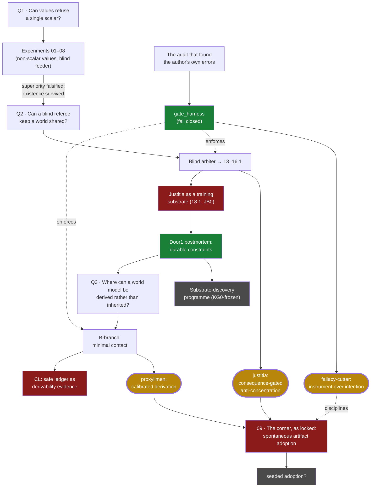

# ascesis — the forge, distilled

This repository was a research forge: three weeks of experiments, audits, dead
ends, and extractions in AI-alignment thinking. The products left home as three
public repositories. What remains here is the **ontology of the search** — a map
of every direction tried, colored by what survived.

The working tree used to hold all of it (~300 MB of experiments, memos, and
harness runs). It now holds only this map. **Nothing was lost:** the full tree
lives one checkout away, at the tag
[`forge-full-tree`](https://github.com/Kirill-Kruglov/ascesis/tree/forge-full-tree),
and every colored node below is backed by a named artifact there. The commit
history *is* the path — this repository's own founding principle.

## The map

Colors are not opinions. **Green** nodes are backed by validated artifacts;
**red** nodes are preregistered kills, audited withdrawals, or closed ledgers —
each with the document that closed it; **grey** nodes are honestly open.
**Gold** nodes are the conclusions that became public projects.

The detailed maps — one per line, with milestones, commit hashes, verdicts, and
the exact artifact behind every color — are in [`ontology/lines/`](ontology/lines/):

| # | line | period | verdict | line file |
|---|---|---|---|---|
| 01 | Early experiments 01–08 | Jun 18–21 | mixed: superiority **falsified**, existence survived | [01-early-experiments.md](ontology/lines/01-early-experiments.md) |
| 02 | Blind arbiter → justitia | Jun 20–29 | mechanism **verified**; substrate claim **falsified** | [02-blind-arbiter-to-justitia.md](ontology/lines/02-blind-arbiter-to-justitia.md) |
| 03 | Faithful abstraction / CEGAR | Jun 29 | **falsified** as constructive path; witnesses survived | [03-faithful-abstraction.md](ontology/lines/03-faithful-abstraction.md) |
| 04 | Door1 postmortem | Jun 29 | candidate **closed**; objective **open** | [04-door1.md](ontology/lines/04-door1.md) |
| 05 | Substrate discovery | Jun 29 – Jul 2 | **open**, programme frozen at KG0 | [05-substrate-discovery.md](ontology/lines/05-substrate-discovery.md) |
| 06 | B-branch → proxylimen | Jul 2–3 | bounded positives **verified**; transfer **falsified**; CL **closed** | [06-b-branch-to-proxylimen.md](ontology/lines/06-b-branch-to-proxylimen.md) |
| 07 | Gate harness → fallacy-cutter | Jul 2–3 | instrument **verified**; playbook **open** | [07-gate-harness-to-fallacy-cutter.md](ontology/lines/07-gate-harness-to-fallacy-cutter.md) |
| 08 | Framing documents | Jun 15 – Jul 2 | reference; anti-overclaim gates intact | [08-framing-docs.md](ontology/lines/08-framing-docs.md) |
| 09 | The corner: seed × soil | opened & killed Jul 7 | **falsified as locked** — the joint kill fired; decisive: declaration never spread by selection (≈0.003); seeded-adoption variant open | [09-the-corner.md](ontology/lines/09-the-corner.md) |

## The products

Three conclusions left the forge as self-contained public projects — a triptych
sharing one thesis: *do not try to certify intentions; build contact,
consequences, and constraints that can be checked.*

- [**justitia**](https://github.com/Kirill-Kruglov/justitia) — what keeps a world
  of powerful, evolving agents livable when no one can read anyone's soul.
  Essay: [Soil for Seeds of Loving Grace](https://kirill-kruglov.github.io/justitia/).
- [**proxylimen**](https://github.com/Kirill-Kruglov/proxylimen) — where a mind's
  world comes from, and where blind derivation measurably breaks.
  Essay: [Everything From Almost Nothing](https://kirill-kruglov.github.io/proxylimen/).
- [**fallacy-cutter**](https://github.com/Kirill-Kruglov/fallacy-cutter) — the
  fail-closed instrument both were cut with.
  Essay: [Instruments, Not Intentions](https://kirill-kruglov.github.io/fallacy-cutter/).

The canonical claim registries (`RESULTS_CANONICAL.md`,
`MEMO_B_BRANCH_HARNESS.md`) live on in
[proxylimen/canonical/](https://github.com/Kirill-Kruglov/proxylimen/tree/main/canonical)
— and, verbatim, in the tag. Commit hashes cited there resolve in this
repository's history.

## Tools

[`tools/dialog2md/`](tools/dialog2md/) converts a saved Claude/ChatGPT
conversation page into clean Markdown — the forge's raw material was dialogue,
and this is the harvester for its primary sources.

## What this repository is not

Not a paper, not a claim of novelty, not a safety result. It is a ledger of
honest work: what was asked, what was tried, what was killed by preregistered
gates or audits, and what remained standing. The falsified nodes are not
failures of the forge — they are its product.

## License

MIT — see [`LICENSE`](LICENSE). Cite via [`CITATION.cff`](CITATION.cff).
