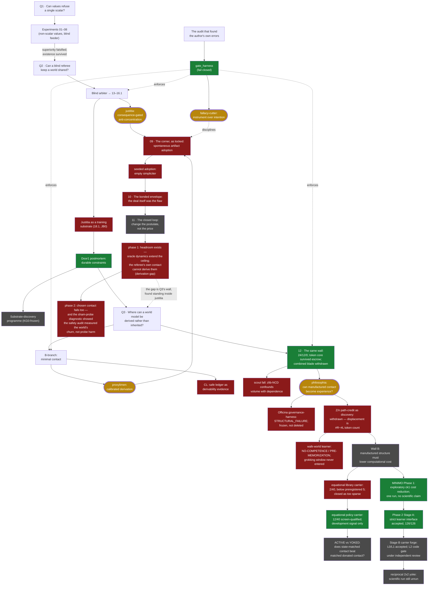

# ascesis — the forge, distilled

This repository began as a three-week research forge of experiments, audits,
dead ends, and extractions in AI-alignment thinking. The products left home as
four public repositories; the Philosophia successor then continued the search.
What remains here is the **ontology of the search** — a map of every direction
tried, colored by what survived.

The working tree used to hold all of it (~300 MB of experiments, memos, and
harness runs). It now holds only this map. **Nothing was lost:** the original
full tree lives one checkout away, at the tag
[`forge-full-tree`](https://github.com/Kirill-Kruglov/ascesis/tree/forge-full-tree),
and the later Philosophia continuation lives in its named public sibling. Every
colored node below is backed by an artifact or commit in one of those ledgers.
The commit history *is* the path — this repository's own founding principle.

## The map

Colors are not opinions. **Green** nodes are backed by validated artifacts;
**red** nodes are preregistered kills, audited withdrawals, or closed ledgers —
each with the document that closed it; **grey** nodes are honestly open.
**Gold** nodes are the conclusions that became public projects.

The detailed maps — one per line, with milestones, commit hashes, verdicts, and
the exact artifact behind every color — are in [`ontology/lines/`](ontology/lines/):

| # | line | period | verdict | line file |
|---|---|---|---|---|
| 01 | Early experiments 01–08 | Jun 18–21 | mixed: superiority **falsified**, existence survived | [01-early-experiments.md](ontology/lines/01-early-experiments.md) |
| 02 | Blind arbiter → justitia | Jun 20–29 | mechanism **verified**; substrate claim **falsified** | [02-blind-arbiter-to-justitia.md](ontology/lines/02-blind-arbiter-to-justitia.md) |
| 03 | Faithful abstraction / CEGAR | Jun 29 | **falsified** as constructive path; witnesses survived | [03-faithful-abstraction.md](ontology/lines/03-faithful-abstraction.md) |
| 04 | Door1 postmortem | Jun 29 | candidate **closed**; objective **open** | [04-door1.md](ontology/lines/04-door1.md) |
| 05 | Substrate discovery | Jun 29 – Jul 2 | **open**, programme frozen at KG0 | [05-substrate-discovery.md](ontology/lines/05-substrate-discovery.md) |
| 06 | B-branch → proxylimen | Jul 2–3 | bounded positives **verified**; transfer **falsified**; CL **closed** | [06-b-branch-to-proxylimen.md](ontology/lines/06-b-branch-to-proxylimen.md) |
| 07 | Gate harness → fallacy-cutter | Jul 2–3 | instrument **verified**; playbook **open** | [07-gate-harness-to-fallacy-cutter.md](ontology/lines/07-gate-harness-to-fallacy-cutter.md) |
| 08 | Framing documents | Jun 15 – Jul 2 | reference; anti-overclaim gates intact | [08-framing-docs.md](ontology/lines/08-framing-docs.md) |
| 09 | The corner: seed × soil | opened & killed twice, Jul 7 | **falsified simpliciter** — spontaneous adoption never ignites; forced adoption *narrows* the domain; trust without verification loses it entirely | [09-the-corner.md](ontology/lines/09-the-corner.md) |
| 10 | The bonded envelope | opened & killed Jul 8 | **falsified as locked** — price alone does not separate (P0 worst); contingent stakes do not heal; the guard fired: the channel concentrates structurally; synthesis: rewarding legibility with a softer sword is moral hazard by construction | [10-the-bonded-envelope.md](ontology/lines/10-the-bonded-envelope.md) |
| 11 | The closed loop | opened Jul 8; phases 1–2 ran Jul 8–9 | **open; phase 1: derivation gap; phase 2: killed as locked, instrument implicated** — headroom **verified** (oracle extends the ceiling to the grid top, 1.8); derivation **falsified** twice: neither passive nor *chosen* contact earns authority; the phase-2 sham-probe diagnostic (INFERENCE) shows the safety audit measured the world's churn, not probe harm — the one component without its own null control strangled the experiment; lesson: an audit without a counterfactual measures the world, not the intervention; phase 3 open | [11-the-closed-loop.md](ontology/lines/11-the-closed-loop.md) |
| 12 | The same wall | opened Jul 9; primary + holdout closed Jul 11 | **bounded instrument verified; combined blade falsified on escrowed holdout** — the 24/12/0 gradient survived as evidence about error dependence; the token core transferred, while H4 killed world-portability of the journal+token blade | [12-the-same-wall.md](ontology/lines/12-the-same-wall.md) |
| 13 | Philosophia | opened Jul 11; successor through Stage-B L2 review Aug 14 | essay **published as project**; Officina, Z/n path-credit, pre-memorization learner and equational library carrier **closed**; policy carrier and bounded MINIMO feasibility **verified as development artifacts only**; strict Phase-2 instrument accepted; reciprocal SELF/YOKED experiment **unrun** | [13-philosophia.md](ontology/lines/13-philosophia.md) |

The Philosophia arc has explicit backing artifacts for every color:

- **Gold — philosophia:** the manufactured-contact question became the fourth public essay. Artifact: `philosophia/essay/climbing-the-wall-of-experience.md`.
- **Green — the same-wall instrument:** the 24/12/0 gradient and escrowed H4 miss bound the surviving token core and withdrew the combined blade. Artifacts: `philosophia/inheritance/line12_same_wall/experiment_A/{decision.json,holdout_result.json}` and `philosophia/gate_harness/`.
- **Red — Officina governance-harness:** terminal `STRUCTURAL_FAILURE`; frozen rather than erased. Artifacts: `philosophia@officina-governance-frozen-2026-08-07` and `philosophia/src/philosophia/officina/FROZEN.md`.
- **Red — Z/n path-credit as a discovery experiment:** withdrawn because its manufacturable invariant is displacement, directly recoverable as `#R−#L`; the pilot exposed token-count structure and failed its own design-validation prediction, while process-over-outcome supervision is already marked as prior art rather than this programme's result. Artifacts: `philosophia/successor/dev/{B2_PATH_VS_DESTINATION_DESIGN_V2.md,B2_PILOT_08.md}` and `philosophia/essay/climbing-the-wall-of-experience.md` ("The road must add something beyond the destination").
- **Red — walk-world competence probe:** the learner never fitted the training set, so the grokking window was never entered; this is `NO-COMPETENCE / PRE-MEMORIZATION`, not evidence against grokking. Artifacts: `philosophia@3f6aa10`, `philosophia/successor/dev/GROKKING_PROBE_09.md`.
- **Red — equational library carrier:** a preregistered fresh-frame audit found `2/40` usable presentations against a threshold of five, so the carrier was closed without an ACTIVE/YOKED run. Artifacts: `philosophia@aa07549`, `philosophia@ff430ba`, `philosophia@1dee42c`, `philosophia@42e2409`, and `philosophia/successor/dev/WALLB_EQUATIONAL_CELL_CLOSURE.md`.
- **Green — equational policy screen:** after the first beam instrument failed its positive control, the repaired hard-oracle screen qualified `12/40` presentations under frozen `best_first`. This is validated development evidence, not a scientific Philosophia result. Artifacts: `philosophia@7e944f9`, `philosophia@bdcb09e`, `philosophia@4817e7e`, and `philosophia/successor/dev/WALLB_POLICY_CHANNEL_AUDIT_14B.md`.
- **Green — exploratory MINIMO feasibility:** in one CPU-debug training realization, checkpoint 1 reduced capped held-out proof-search work relative to checkpoint 0; the terminal package explicitly makes no population, stability, SELF/YOKED or Philosophia claim. The Lenovo Legion RTX 4060 runs were stopped as performance-feasibility attempts and excluded from evidence. Artifacts: `philosophia@b0b9adf`, `philosophia/successor/dev/{PHASE1_TERMINAL_18.md,PHASE1_MINIMO_REPRO_15.md}`.
- **Green — strict Phase-2 interface instrument:** exact query transport, complete canonical action handling, search accounting, isolation and replay passed the accepted `126/126` Stage-A gate. Artifact: `philosophia@41adcaa`, especially `successor/dev/PHASE2_STAGE_A_DRIVER_CLOSURE_19.md` and `minimo_phase2_stage_a_19.patch`.
- **Grey — carrier construction and reciprocal yoke:** Stage-B has an accepted schema/checker and a generated-fixture code gate under independent review; identities, compiler, selector qualification and the scientific reciprocal `2 x 2` comparison remain unrun. Current named artifacts and hashes are preserved in [13-philosophia.md](ontology/lines/13-philosophia.md); the scientific design is anchored by `philosophia@41adcaa:successor/dev/PHASE2_POST_REVIEW_DRIVER_DECISION_19.md`.

## The products

Four conclusions left the forge as self-contained public projects — a sequence
sharing one thesis: *do not try to certify intentions; build contact,
consequences, and constraints that can be checked.*

- [**justitia**](https://github.com/Kirill-Kruglov/justitia) — what keeps a world
  of powerful, evolving agents livable when no one can read anyone's soul.
  Essay: [Soil for Seeds of Loving Grace](https://kirill-kruglov.github.io/justitia/).
- [**proxylimen**](https://github.com/Kirill-Kruglov/proxylimen) — where a mind's
  world comes from, and where blind derivation measurably breaks.
  Essay: [Everything From Almost Nothing](https://kirill-kruglov.github.io/proxylimen/).
- [**fallacy-cutter**](https://github.com/Kirill-Kruglov/fallacy-cutter) — the
  fail-closed instrument both were cut with.
  Essay: [Instruments, Not Intentions](https://kirill-kruglov.github.io/fallacy-cutter/).
- [**philosophia**](https://github.com/Kirill-Kruglov/philosophia) — whether
  first-hand experience can be manufactured from contact with a derivable world.
  Essay: [Climbing the Wall of Experience](https://github.com/Kirill-Kruglov/philosophia/blob/main/essay/climbing-the-wall-of-experience.md).

The canonical claim registries (`RESULTS_CANONICAL.md`,
`MEMO_B_BRANCH_HARNESS.md`) live on in
[proxylimen/canonical/](https://github.com/Kirill-Kruglov/proxylimen/tree/main/canonical)
— and, verbatim, in the tag. Commit hashes cited there resolve in this
repository's history.

## Tools

[`tools/dialog2md/`](tools/dialog2md/) converts a saved Claude/ChatGPT
conversation page into clean Markdown — the forge's raw material was dialogue,
and this is the harvester for its primary sources.

## What this repository is not

Not a paper, not a claim of novelty, not a safety result. It is a ledger of
honest work: what was asked, what was tried, what was killed by preregistered
gates or audits, and what remained standing. The falsified nodes are not
failures of the forge — they are its product.

## License

MIT — see [`LICENSE`](LICENSE). Cite via [`CITATION.cff`](CITATION.cff).
