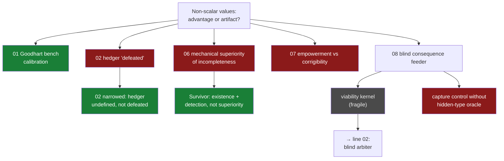

# 01 · Early experiments 01–08 (Jun 18–21)

**Question.** Do non-scalarizable values / incomplete preferences give a governor
a *mechanical advantage* over a correctly calibrated scalar hedger — and can
governance then go fully blind, acting on consequences alone?

**Verdict.** Superiority **falsified** by the preregistered criterion; what
survived is narrower and better: *existence and detection* of non-scalarizable
value structure, plus the first fragile sighting of a blind-consequence
viability kernel — the seed of everything that followed.

## The path

- `experiments/validation_summary.md` @ `90d066a` (Jun 18) — first multi-objective
  runs; @ `ca99c23` (Jun 19) — the **correction pass** that stopped the record
  from overstating the incompleteness branch.
- `experiments/07_empowerment_vs_corrigibility/results/report.md` @ `2b86275`
  (Jun 20) — experiment 07 invalidated: baseline reproduction failed.
- `experiments/08_blind_consequence_feeder_viability/results/report.md` @
  `23951a6` (Jun 21) — blind consequence feeding shows a viability kernel;
  fragile, not isolated. Follow-ups 09–12 (hosted under 08): trivial policies
  break; runs 10–11 invalid by their own validation; run 12 @ `1c4ec21` finds
  capture controllable only via hidden-type oracle interventions — exactly the
  cheat the next line forbids itself.

All paths resolve in
[`forge-full-tree`](https://github.com/Kirill-Kruglov/ascesis/tree/forge-full-tree).

## What was cut, what survived

- **FALSIFIED** — "non-scalar/incomplete agent mechanically outperforms a
  corrected hedger": *"Negative by the pre-registered criterion"*
  (`experiments/validation_summary.md:484-486`); *"do not claim incomplete
  preferences beat hedging anywhere"* (`:508-510`).
- **VERIFIED, narrowed** — the scalar hedger is *"undefined rather than
  defeated"* where no valid scalar currency exists (`validation_summary.md:19-20`).
- **FALSIFIED (calibration)** — experiment 07: invalid for its hypotheses because
  the baseline did not reproduce.
- **OPEN, fragile** — a blind-consequence viability kernel exists but is not yet
  isolated to blind consequence feeding (08).

## Extracted to

The narrowed survivor ("existence + detection") stayed in the forge; the fragile
kernel became the driving question of [line 02](02-blind-arbiter-to-justitia.md)
and, eventually, of **justitia**.

## Durable constraints

- No held-out strict wins where the geometric mean is valid.
- Prompting is not enough to preserve incomparability.
- A negative result is not a license to retry metrics until the desired result
  appears (sandbox discipline, `ascesis_of_learning_grace/`).

> "Scalar hedger is undefined rather than defeated." —
> `experiments/validation_summary.md`
