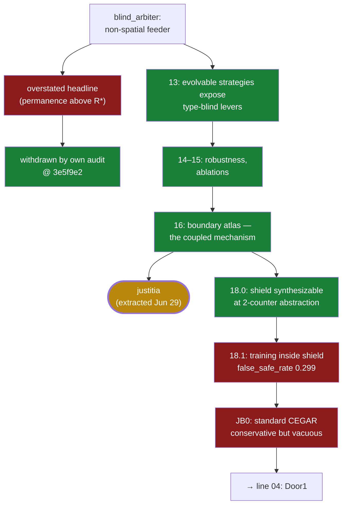

# 02 · Blind arbiter → justitia (Jun 20–29)

**Question.** Can a *type-blind* arbiter — no access to hidden strategy
parameters, only delayed consequences and structure — keep an evolving world
alive and shared under adversarial capture?

**Verdict.** The mechanism is **verified** and became **justitia**:
consequence-gated anti-concentration, one coupled act, not two levers. The
stronger ambition — Justitia as a *training substrate* for deriving world models
— was **falsified** by its own kill gates (18.1, JB0).

## The path

- `blind_arbiter/results/report.md`, commits `0b1daa0` → `dec6bcc` (Jun 20) —
  calibration, audit and boundary-reporting fixes.
- `README.md` @ `3e5f9e2` (Jun 20) — the overstated blind-arbiter headline is
  **withdrawn by the project's own audit** — the forge's first public
  self-correction, before any external reader asked.
- `experiments/13_evolvable_action_strategies/results/report.md` @ `1c4ec21`
  (Jun 21) — the evolvable-strategy substrate exposes type-blind causal levers.
- `…/results_16/boundary_atlas.md` @ `5f88f37`, clarified @ `67f2cb6` (Jun 22) —
  the working object named: **consequence-gated anti-concentration**, not
  independent levers.
- `README.md` @ `3e3d7ca` (Jun 29) — the line is extracted to the external
  justitia repository.
- `experiments/JB/18_0_shield_synthesis/outputs_18_0/summary.md` @ `e88e538` —
  a shield *is* synthesizable at the 2-counter abstraction; then
  `…/18_1_shielded_training/outputs_18_1/summary.md` — the Level-A kill gate
  fires: false-safe rate 0.299. *"Training behind a lying shield manufactures
  false confidence."*

## What was cut, what survived

- **FALSIFIED** — the early headline "blind arbiter holds permanence above the
  boundary"; withdrawn at `3e5f9e2`. What survived it: the ordering
  scalar < lexicographic < geometric — weaker, honest.
- **VERIFIED** — the coupled mechanism (13→16.1), later replayed exactly under a
  fail-closed harness in the justitia repo (J-G1, 22/22).
- **FALSIFIED** — Justitia as a Door1 training-substrate candidate: 18.1 kills
  training-inside-shield; JB0 closes the standard-CEGAR path
  ("conservative but vacuous").

## Extracted to

**justitia** — [repo](https://github.com/Kirill-Kruglov/justitia) ·
[essay](https://kirill-kruglov.github.io/justitia/). Its later harnessed waves
(replay + preregistered kills: blindness-as-information-wall, scalar speed
limits) continued this line's discipline in public; see the essay's *Revisions*.
The substrate failure fed [line 03](03-faithful-abstraction.md) and
[line 04](04-door1.md).

## Durable constraints

- Do not split anti-concentration and consequence-gating into independently
  proven levers; the coupling is the mechanism.
- An abstraction's synthesis success (18.0) must never be trusted without a
  fidelity gate (18.1).

> "The harness catching and correcting an overstated headline." —
> `README.md` @ `3e5f9e2`, the sentence this whole repository grew from.
