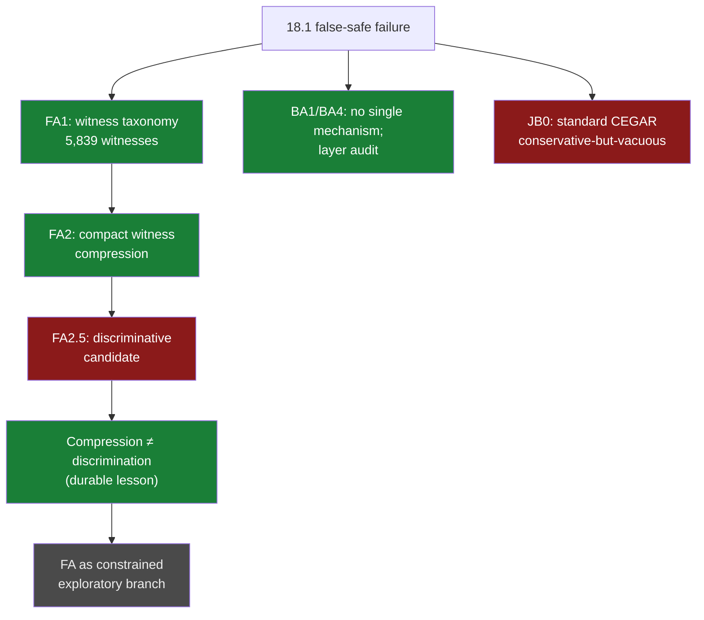

# 03 · Faithful abstraction / CEGAR (Jun 29)

**Question.** After the 18.1 shield failure: can the *missing semantic
information* be identified and preserved, so that a safety abstraction stops
producing false-safe states — a constructive path to faithful abstraction?

**Verdict.** **Falsified as a constructive path.** The witnesses are real (5,839
false-safe witnesses, structured into classes); their compact compression is
demonstrable — but compression is **not** discrimination, and no discriminative
candidate survived validation. Standard CEGAR closed separately:
conservative but vacuous.

## The path

All evidence organized at `e88e538` (Jun 29); the line is reconstructed, with
every unsupported transition marked, in
`research/faithful_abstraction_v1/BRIDGE_MAP_18_1_TO_FA2.md` @ `954f246`.

- `experiments/BA/BA1_E1_monotonicity_breakers/…` — no single clean mechanism
  explains the failure.
- `experiments/BA/BA4_layer_audit/justitia_layer_audit.md` — the layer audit:
  dynamics / policy / observation / projection / reporting must never be
  conflated.
- `experiments/FA/FA1_E1_false_safe_witness_taxonomy/…` — 5,839 witnesses,
  structured.
- `experiments/FA/FA2_E1_minimal_invariant_compression_test/…` — compact
  coverage; precision **unmeasured**.
- `experiments/FA/FA2_5_E1_candidate_validation/…` — classification:
  `No_discriminative_candidate`; the planned next stage must not execute.
- `experiments/JB/JB0_E1_standard_cegar_boundary_assessment/…` —
  `Conservative_but_vacuous`; "Should Justitia remain … NO".

Paths resolve in
[`forge-full-tree`](https://github.com/Kirill-Kruglov/ascesis/tree/forge-full-tree).

## What was cut, what survived

- **VERIFIED** — the failure is real and structured (witness taxonomy); the
  layer discipline (BA4) became a permanent rule of the forge.
- **FALSIFIED** — "compact refinement exists" as a constructive claim:
  *"Compression demonstrated. Discrimination NOT demonstrated."*
  (`BRIDGE_MAP_18_1_TO_FA2.md:351-355`).
- **FALSIFIED** — the standard-CEGAR route to a useful Justitia boundary (JB0).
- **OPEN** — FA as a constrained exploratory branch serving the original goal
  (`BRIDGE_MAP_18_1_TO_FA2.md:641-654`) — explicitly *not* a promise.

## Extracted to

The lesson "compression ≠ discrimination" traveled furthest of anything in this
line: it reappears as a disciplinary move in the falsification playbook
([line 07](07-gate-harness-to-fallacy-cutter.md)) and in **proxylimen**'s
handling of stability-vs-structure ("my honesty check certified a void").

## Durable constraints

- Compression alone must never be read as constructive progress.
- Variables in transition, policy, observation and reporting layers are not
  interchangeable — a layer audit precedes any faithfulness claim.
- Conservative correctness alone is insufficient.

> "Variables are implementation artefacts. Information invariants are semantic
> objects." — `research/faithful_abstraction_v1/00_program.md`
