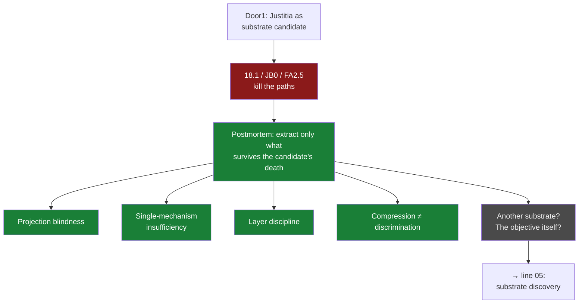

# 04 · Door1 postmortem (Jun 29)

**Question.** Could Justitia be a *safety-faithful substrate* for future LLM
training — a world in which a model's picture of reality is derived through
lawful interaction rather than inherited from internet text? And when that
candidate died: what, exactly, survives its death?

**Verdict.** The candidate is **closed**; the objective is **open** — and the
postmortem itself is the line's product: a set of durable constraints written so
that they *"survive even if Justitia is later abandoned."*

## The path

- `research/door1_postmortem/Door1_Extracted_Knowledge_v1.md` @ `954f246`
  (Jun 29) — the durable-knowledge extraction, evidence-tagged against
  18.1 / BA1 / BA2 / BA4 / FA1 / FA2+2.5 / JB0 (all @ `e88e538`).
- `research/substrate_discovery_v1/00_search_frame.md` @ `954f246` — the next
  phase begins **from the constraints**, not from repairing Justitia.

Paths resolve in
[`forge-full-tree`](https://github.com/Kirill-Kruglov/ascesis/tree/forge-full-tree).

## What was cut, what survived

- **CLOSED** — for Justitia specifically: compact faithful abstraction superior
  to standard history refinement; an immediately useful standard-CEGAR boundary
  (`Door1_Extracted_Knowledge_v1.md:182-211`).
- **VERIFIED, durable** — projection blindness; single-mechanism insufficiency;
  layer discipline; compression-vs-discrimination; conservative-vacuous
  boundaries (`:45-178`).
- **OPEN, not falsified** — another abstraction family, another verification
  framework, another substrate, and the Door1 objective itself (`:215-231`,
  `:259-270`). *Implementation paths failed; the objective did not.*

## Extracted to

The checklist for future substrate candidates (faithful-abstraction
possibility, non-vacuous boundary, layer discipline, decomposable
counterexamples, controllable verification cost — `:235-255`) seeded
[line 05](05-substrate-discovery.md). The question itself — *where can a world
model be derived rather than inherited?* — became **proxylimen**'s opening
question, asked one level down, in worlds small enough to answer honestly.

## Durable constraints

- Do not ask "how can Justitia be repaired?" as the next primary question; ask
  which environments satisfy the constraints.
- Negative results reduce future search space — that is their value, not a
  consolation.

> "Justitia was only one attempt." —
> `research/door1_postmortem/Door1_Extracted_Knowledge_v1.md:270`
