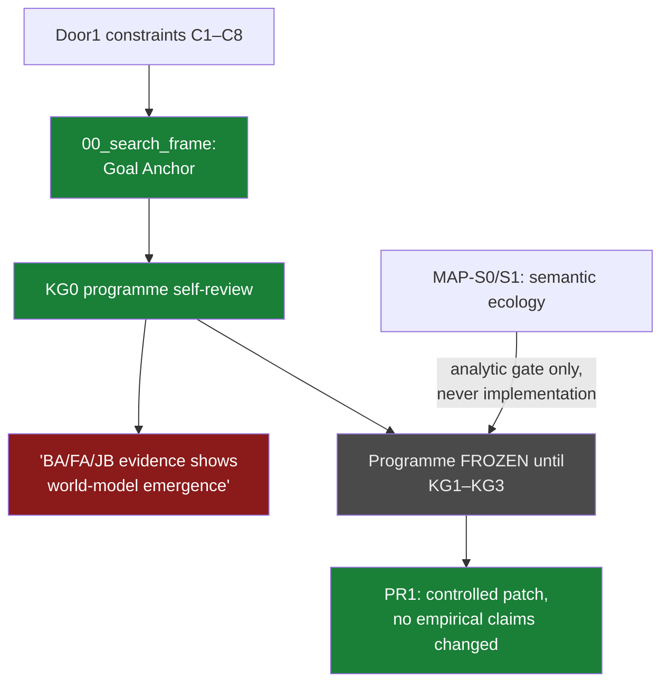

# 05 · Substrate discovery (Jun 29 – Jul 2)

**Question.** Not "which substrate?" but "how to *search* for one without
repeating the Justitia/CL mistakes": a disciplined post-Door1 search frame for
environment classes that could support derived internal world models through
lawful interaction.

**Verdict.** **Open — and deliberately frozen.** The programme reviewed itself
(KG0), accepted its own criticisms, and froze until three kill-gates (KG1–KG3)
resolve the Goal Anchor, the derivability reduction, and internal-model
measurability. No substrate has been found; no claim pretends otherwise.

## The path

- `research/substrate_discovery_v1/00_search_frame.md` @ `954f246` (Jun 29) —
  Goal Anchor + extracted constraints C1–C8, built directly from Door1.
- `research/substrate_discovery_v1/KG0_programme_review.md` @ `bfaafe7` (Jul 2)
  — the programme applies a kill-gate **to itself**: accepted criticisms
  (including AC-5: BA/FA/JB evidence does *not* establish world-model
  emergence), verdict `continue_after_revision`, freeze conditions stated.
- `research/substrate_discovery_v1/PR1_programme_revision.md` @ `bfaafe7` — the
  controlled patch; no empirical claim changed.
- `research/MAP-S1_Literature-grounded_Constraint_Refinement.md` @ `bfaafe7` —
  the semantic-ecology candidate survives *only* as an analytic object:
  "ADMISSIBLE FOR S0 ANALYTIC GATE. NOT ADMISSIBLE FOR IMPLEMENTATION."

Paths resolve in
[`forge-full-tree`](https://github.com/Kirill-Kruglov/ascesis/tree/forge-full-tree).

## What was cut, what survived

- **FALSIFIED as a current claim** — that existing evidence demonstrates
  world-model emergence (KG0, AC-5).
- **VERIFIED** — the programme's constitution: *"Authority belongs only to:
  evidence; successful falsification; successful survival of kill-gates"*
  (`KG0_programme_review.md:161-165`).
- **OPEN** — everything substantive: frozen until KG1 (Goal Anchor), KG2
  (derivability reduction), KG3 (internal-model measurability). KG1 was
  recorded as currently unrunnable — honestly.

## Extracted to

Nothing was extracted as a product — by design. The *method* of this line
(programme-level kill-gates, freeze-don't-drift) was extracted into the
falsification playbook as disciplinary move #10
([line 07](07-gate-harness-to-fallacy-cutter.md), with its N=1 caveat).
**proxylimen** inherited the question's lower bound; this line still owns its
upper bound.

## Durable constraints

- No use of "derivability" as an established construct until KG2.
- No internal-model success claims until KG3.
- Sanskrit/Pāṇini and any "beautiful generator" may inform lineage of forms;
  they cannot certify meaning (MAP-S1).

> "The programme should not continue unchanged. … The programme should also not
> be terminated at KG0." — `KG0_programme_review.md:190-195`
