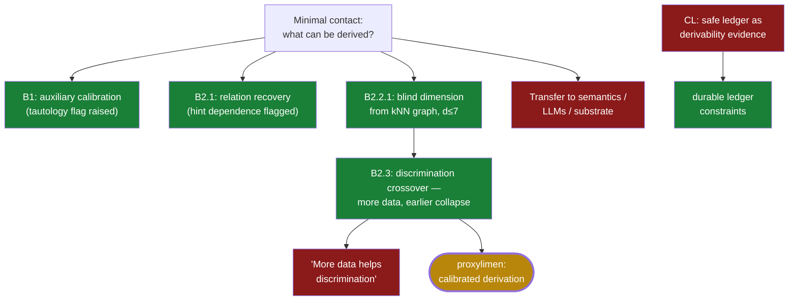

# 06 · B-branch → proxylimen (Jul 2–3)

**Question.** Can *minimal contact* — auxiliary calibration, bare relations, a
kNN graph with no coordinates and no oracle — support bounded identifiability
and blind-dimension claims that survive a fail-closed harness? Subline **CL**:
can a safe action ledger serve as substrate/derivability *evidence*?

**Verdict.** Four **harness-valid bounded positives** (B1, B2.1, B2.2.1, B2.3)
— each with its caveat carried on its face; **no transfer** to semantics,
language, LLMs, or substrate claims; the CL subline **closed** negatively with
durable constraints. This line became **proxylimen**.

## The path

- `MEMO_B_BRANCH_HARNESS.md` @ `4718c0e` (Jul 2) — the audit (10 findings, 3
  critical) that forced the harness; the branch reran *through* it.
- `experiments/B/B1_harness_rerun/decision.json` @ `8ccefba` — B1 harness-valid;
  the harness itself raised `construction_may_be_tautological: true`.
- `experiments/B/B2_harness_rerun/decision.json` @ `c129bd0` — B2.1 relation
  recovery; the `truth_axes=3` hint dependence recorded on the decision.
- `gate_harness_experiments/B2_2_1/decision.json` @ `b60683f` — blind dimension
  estimation from the kNN graph alone, hint dependence **false**.
- `gate_harness_experiments/B2_3/decision.json` @ `fcb3fe0` (Jul 3) — the signed
  crossover: d\*=130 at n=1000, d\*=24 at n=5000.
- `RESULTS_CANONICAL.md` @ `5f750b8` — the claim-strength registry ("any essay
  statement must be no stronger than the claim recorded here").
- `research/closed_directions_ledger.md` @ `bfaafe7` — CL0…CL2.2 closed: the
  safe ledger is a *precondition*, never substrate evidence.

Paths resolve in
[`forge-full-tree`](https://github.com/Kirill-Kruglov/ascesis/tree/forge-full-tree);
the registries live on in
[proxylimen/canonical/](https://github.com/Kirill-Kruglov/proxylimen/tree/main/canonical).

## What was cut, what survived

- **VERIFIED (bounded)** — the four positives above, each *with* its recorded
  caveat: B1 partly guaranteed by construction; B2.1 not blind discovery;
  B2.2.1 only literature-table rows d≤7; B2.3 a discrimination boundary, never
  dimension accuracy.
- **FALSIFIED** — "more data extends the test's reach" (the crossover moved
  *inward*); and every transfer claim: no semantic grounding, no language, no
  LLM training, no substrate, no real-world transfer
  (`RESULTS_CANONICAL.md:233-249`).
- **CLOSED (CL)** — state-level safe→learner ledgers; oracle-filtered ledgers as
  substrate evidence; rule-family learners as learning evidence.

## Extracted to

**proxylimen** — [repo](https://github.com/Kirill-Kruglov/proxylimen) ·
[essay](https://kirill-kruglov.github.io/proxylimen/) ·
[Appendix A](https://kirill-kruglov.github.io/proxylimen/appendix-a.html).
The pre-harness B decisions travel with it under
`experiments/superseded_invalid/` — kept as evidence that the method marked the
author's own errors non-citable.

## Durable constraints

- Future learner ledgers must be action- or transition-conditioned.
- Anti-artifact controls must defeat prior-dependence, not only field leakage.
- Toy-domain boundary success does not transfer without a separate transfer gate.

> "Any essay statement must be no stronger than the claim recorded here." —
> `RESULTS_CANONICAL.md:3`
