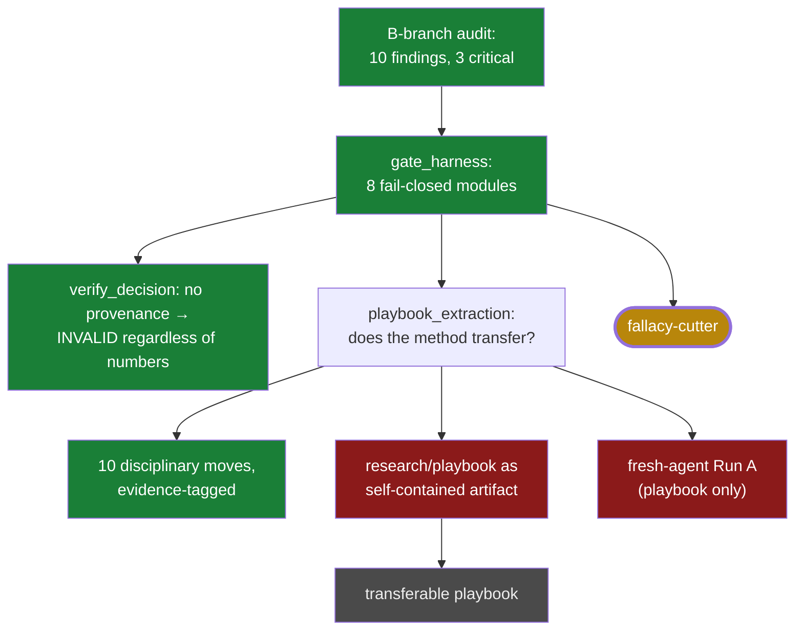

# 07 · Gate harness → fallacy-cutter (Jul 2–3)

**Question.** Not a new result — new *machinery against overclaim*: can the
discipline that kept killing this forge's own headlines (preregistration,
leakage scans, hint detection, seed policy, provenance) become an instrument no
honest process can bypass — and then a transferable method?

**Verdict.** The **instrument is verified** — fail-closed, adversarially
tested, each defense mapped to a real audit finding. The **transferable
playbook is open**: the extraction pass honestly found the method
"real but mis-located" — living in task specs and practice, not yet in a
document a stranger could execute cold. This line became **fallacy-cutter**.

## The path

- `MEMO_B_BRANCH_HARNESS.md` @ `4718c0e` (Jul 2) — the hostile self-audit: 10
  findings, 3 critical (post-hoc thresholds committed atomically; thresholds
  introduced with the results they fit; hardcoded audit fields masking a live
  leak).
- `gate_harness/` (Jul 2 series) — the eight modules; adversarial tests each
  RED without its defense, GREEN with it.
- `RESULTS_CANONICAL.md` @ `5f750b8` — claim-strength ceiling as an artifact.
- `playbook_extraction/SUMMARY.md` @ `bfaafe7` — falsification applied to the
  falsification method itself: *"method strong, playbook artifact nearly
  empty"*; the usability test's Run A fails, Run B succeeds only because the
  task spec carries the method.

Paths resolve in
[`forge-full-tree`](https://github.com/Kirill-Kruglov/ascesis/tree/forge-full-tree).

## What was cut, what survived

- **VERIFIED** — the harness: decisions without `_harness_provenance` are
  *"INVALID unconditionally, regardless of numbers"*; legacy pre-harness
  decisions became non-citable, including the forge's own.
- **VERIFIED** — the ten disciplinary moves (multiply demonstrated 1–9;
  programme-gates as #10 with an honest N=1 caveat).
- **FALSIFIED** — `research/playbook/` as a self-contained method: *"the
  playbook is a signboard, not the building."*
- **OPEN, limited** — the harness is not proof against malicious code or full
  dataflow; the method is demonstrated as a *falsifier*, not yet as a
  constructor of positive knowledge.

## Extracted to

**fallacy-cutter** — [repo](https://github.com/Kirill-Kruglov/fallacy-cutter) ·
[essay](https://kirill-kruglov.github.io/fallacy-cutter/). Its first field
transfer test (harnessing justitia: one exact replay PASS, four preregistered
kills published as-is, six documented doc-gaps, and one fail-open defect caught
by review rather than by the harness) is recorded in
[methodology/04](https://github.com/Kirill-Kruglov/fallacy-cutter/blob/main/methodology/04_first_transfer_test.md)
— the OPEN node above, now "tested once, partially."

## Durable constraints

- Nothing passes by default.
- Every worked example so far is a negative; treat "constructor of positive
  knowledge" as an untested claim.
- Populate the playbook from task specs, then rerun the usability test with the
  answer key hidden — only then name the framework.

> "The method is real but mis-located." — `playbook_extraction/SUMMARY.md`
