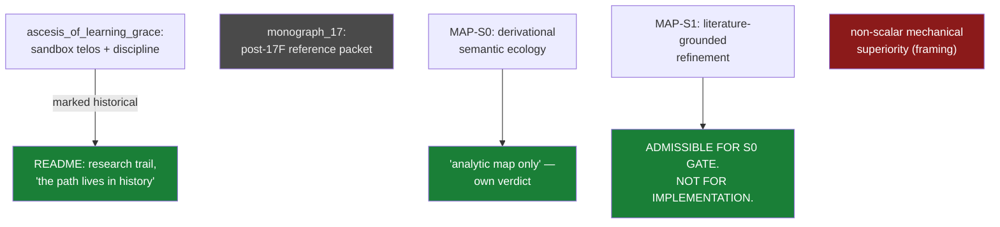

# 08 · Framing documents (Jun 15 – Jul 2)

**Question.** What holds a forge together between experiments: the telos, the
discipline, the speculative maps — and which of these are *evidence*, which are
*reference*, and which are explicitly forbidden from becoming claims?

**Verdict.** Reference, kept honest. The historical sandbox is marked
historical; the speculative maps carry their own anti-overclaim verdicts on
their faces; the one framing claim that drifted into a headline was withdrawn
by the project's own audit within days.

## The path

- `README.md` @ `d1c643f` (Jun 15) — the founding map: *"not a scientific paper,
  not a claim of contribution, not a claim of novelty"*; the honest path
  *"lives in the commit history as much as in the current files."* This
  ontology is that sentence, executed.
- `ascesis_of_learning_grace/` — the sandbox's telos, discipline, and rejected
  branches; `status.md` marked historical, navigation ceded to
  `research/README.md` @ `954f246`.
- `research/monograph_17/ASCESIS_PROJECT_INDEX_v2.md` @ `bfaafe7` — the
  post-17F reference packet.
- `research/MAP-S0_Derivational_Semantic_Ecology.md`,
  `research/MAP-S1_Literature-grounded_Constraint_Refinement.md` @ `bfaafe7` —
  speculative maps that police themselves: Pāṇini as a possible derivational
  engine, never as certified meaning.

Paths resolve in
[`forge-full-tree`](https://github.com/Kirill-Kruglov/ascesis/tree/forge-full-tree).

## What was cut, what survived

- **VERIFIED** — the framing discipline itself: every map carries its own gate;
  a negative result is not a license to retry metrics until the desired result
  appears.
- **FALSIFIED** — the framing-level bet on non-scalar mechanical superiority
  (`ascesis_of_learning_grace/rejected_branches.md`;
  `experiments/validation_summary.md:508-510`) — see
  [line 01](01-early-experiments.md).
- **OPEN / reference** — monograph_17 and the MAP-S* candidates, admissible only
  to their analytic gates.

## Extracted to

The telos ("machines of loving grace need soil") became **justitia**'s essay
frame; the discipline became [line 07](07-gate-harness-to-fallacy-cutter.md);
the "derived, not inherited" ambition became **proxylimen**'s question. The
maps stay here, gated.

## Durable constraints

- Coherence, synthetic corpora, and fractal beauty are not substrate success;
  stable claims require consequence obligations and anchors (MAP-S1).
- Historical documents stay historical: they are quoted, never silently
  promoted back into current claims.

> "Sanskrit / Pāṇini can help with lineage of forms. It cannot certify
> meaning." — `research/MAP-S1_Literature-grounded_Constraint_Refinement.md`
