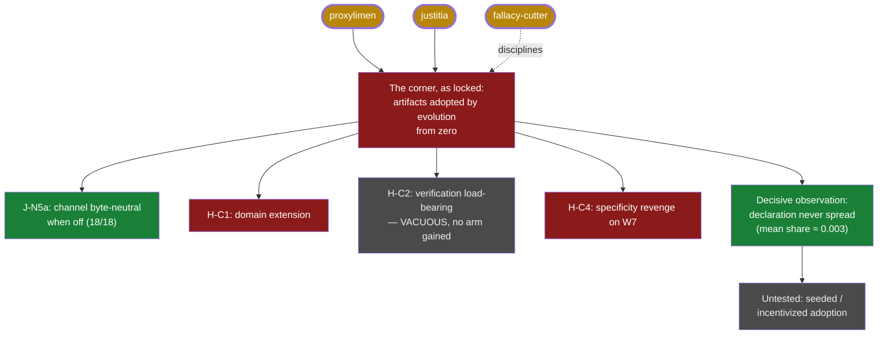

# 09 · The corner: seed × soil (opened Jul 7 — killed Jul 7, as locked)

**Question.** proxylimen built the seed — a learner whose knowledge carries
declared contact, named handles, and measured failure boundaries. justitia
built the soil — blind governance that keeps a world shared without reading
anyone's internals. Are they compatible? Is there a corner where both walls
hold — a referee that reads *verifiable procedural artifacts*, never
intentions, and thereby governs faster than consequences alone allow?

**Verdict.** **FALSIFIED, as locked — on the day it was opened.** The joint
kill-condition, written before the first run, fired: verified artifacts neither
widened the adversarial-pressure domain (J-N5, H-C1 FAIL) nor restored the
sword's specificity on the held-out world (J-N5b, H-C4 FAIL). The node turns
red exactly as its own text promised it would.

## What the numbers say

All decisions harness-signed and VALID
([final report](https://github.com/Kirill-Kruglov/justitia/blob/main/experiments/harnessed/W8_corner_final_report.md)):

- **J-N5a (engineering): PASS** — the artifact channel is a purely additive
  subclass (`model/artifacts.py`; no existing model file touched) and
  byte-identical to published behavior when off, 18/18 headline cells.
- **J-N5: FAIL / VACUOUS / PASS** — pressure ceilings tie at 1.2 for all three
  arms in the mutation corridor; the 24-seed robust bar left the other two
  worlds unmeasurable *for every arm including baseline* (a recorded
  instrument-surface limitation, not an excuse). H-C2 returned **VACUOUS** —
  the preregistered third verdict added at review: since neither the trusted
  nor the verified arm beat baseline anywhere, the question "is verification
  load-bearing?" received no data. H-C3 passed: the channel costs nothing.
- **J-N5b: FAIL** — on the held-out W7, the verified arm did not reduce false
  containment (0.534 vs 0.497); permanence unchanged (0.875).

## The decisive observation

Declaration propensity started at 0.0 — by design: legibility had to be *earned
by selection*, not installed. It never was. Mean declared share stayed near
0.003 across all arms; brief flickers to ~0.27 died out. The corner mechanism
was built, verified inert-when-off, wired into the sword — **and the evolving
population never picked it up.** Everything downstream of adoption is therefore
untested by this askesis: what died is the *spontaneous-emergence* corner.

An honest reading of why, filed as INFERENCE: zone-level declarations make
softened containment a public good — the lineage that pays the declaration
carries the conformance risk while free-riders share the shelter. Selection
gradients on public goods are notoriously weak. The corner may be empty, or
merely unreachable by drift from zero in eighty steps.

## What remains open

- **W8b (grey, no promise):** seeded or individually-incentivized adoption —
  does the corner exist when the torch is lit by hand? A different claim from
  the one that died; it would need its own preregistration.
- The irreducible remainder stands untouched: truth-calibration does not entail
  viability-alignment. Nothing in W8 tested that.

## Lineage

Grew out of [line 06](06-b-branch-to-proxylimen.md) ×
[line 02](02-blind-arbiter-to-justitia.md), disciplined by
[line 07](07-gate-harness-to-fallacy-cutter.md). Opened, preregistered, run,
and killed within one day — the forge's fastest full cycle, and the first line
*born* on the distilled table. The map showed it grey before the runs and shows
it red after; at no point did it show it flattering.

> The corner was empty — or evolution never walked into it. The locked claim
> cannot tell these apart, so it died, and the distinction it could not make
> is the next question's name.
