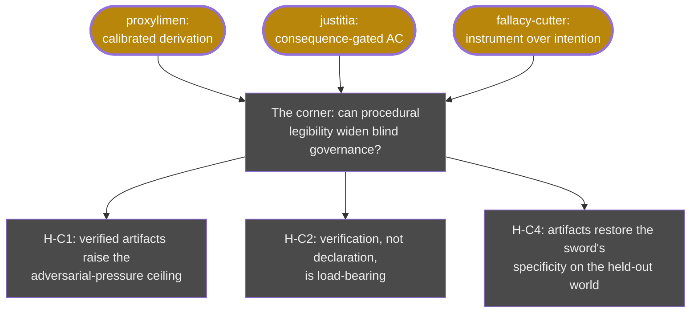

# 09 · The corner: seed × soil (opened Jul 7 — **OPEN**)

**Question.** proxylimen built the seed — a learner whose knowledge carries
declared contact, named handles, and measured failure boundaries. justitia
built the soil — blind governance that keeps a world shared without reading
anyone's internals. Are they compatible? Do seed and soil drift apart as the
seed grows more capable — or is there a corner where both walls hold?

**Status.** Open. This line has a design, preregistered-hypothesis drafts, and
a kill-condition — and no results yet. It is recorded here *before* the first
run, on the forge's own rule that the map shows directions when they are
opened, not when they flatter.

## The reasoning that opened it

- The soil's measured resource is the **legibility of consequences**
  (justitia five-dial isolation): harm that travels is governable; a more
  capable seed compresses the time before irreversibility — capability growth
  erodes the soil's domain.
- But a calibrated seed is itself a *legibility technology*: its actions can
  carry verifiable procedural artifacts — preregistrations that fail closed.
  A blind referee that reads **artifacts, never intentions** gains a
  pre-consequence channel; and honesty becomes incentive-compatible, because
  the held-out-world result showed over-policing falls hardest on the
  illegible innocent (false containment 0.52).
- The irreducible remainder stays: truth-calibration does not entail
  viability-alignment. The seed guards truth; the soil guards viability;
  neither subsumes the other. The corner is inhabitable *because* the walls
  are different boundaries.

## The experiment (preregistration drafted)

W8, "procedurally legible agents", on the justitia substrate behind an
equivalence gate: three arms (no channel / declarations trusted blindly /
declarations verified fail-closed), evolvable lying, blindness invariant
(declarations speak only the observable vocabulary; the channel passes the
same leakage scan). Kill-condition, stated in advance: **if the verified
channel neither widens the pressure ceiling nor restores specificity on the
held-out world, the corner is empty** — and this node turns red.

## Lineage

Grew out of [line 06](06-b-branch-to-proxylimen.md) ×
[line 02](02-blind-arbiter-to-justitia.md), disciplined by
[line 07](07-gate-harness-to-fallacy-cutter.md); triggered by an outside
observation (Anthropic's J-lens, Jul 2026) that intervention handles into a
model's privileged representations are becoming real — the seed side of the
corner is no longer hypothetical.

> Seed and environment are not two systems to reconcile. A world that can
> prove you wrong is already soil; a learner that declares its contact is
> already legible. The question is only whether the two disciplines meet
> before the world outruns them.
