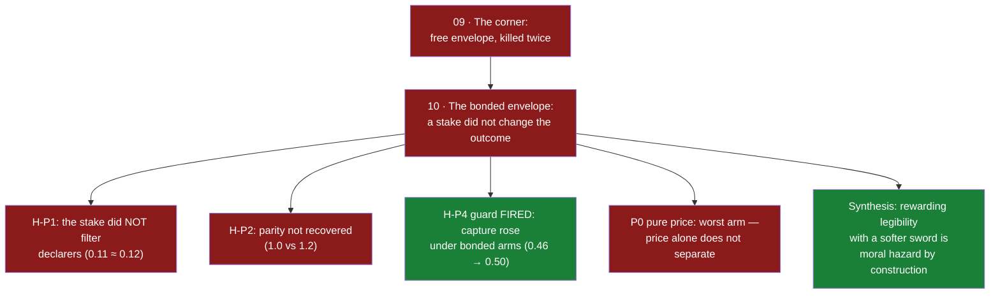

# 10 · The bonded envelope (opened Jul 8 — killed Jul 8, as locked)

**Question.** Line 09 killed the free envelope twice: a costless promise about
outcomes is a subsidy to the defector, and an envelope loose enough to be kept
is loose enough to hide in. This line asks the next honest question: **does a
stake change the outcome?** A declaration backed by a contingent, mechanically
forfeited escrow — the hostage model (Schelling; Williamson 1983) — rather than
a costless one.

**Verdict.** **FALSIFIED, as locked.** The kill fired: verified stakes at both
levels neither recovered parity with the no-channel baseline nor cleared the
held-out world's directional bar. Third death of the envelope family — and the
most instructive, because this one named the flaw.

## Design constraints, learned from literature and from a play

The stake is designed against Shylock's bond — the canonical *badly* designed
forfeit, whose every failure is a constraint here:

- **fungible** (resource currency, not flesh);
- **proportional** (a fraction, not an absolute — rich and poor zones stake the
  same share);
- **survivable** (forfeiture takes the escrow, not the zone's viability);
- **mechanical** (fail-closed, no referee discretion — a contract no court has
  to break to survive) — and the forfeit is **destroyed**, so the knife has no
  beneficiary and no one profits from wishing violation upon you.

## The death, and what it named (all decisions VALID, 15/15 across five waves)

The kill fired exactly as locked. The numbers, arm by arm:

- **P0 (pure nonrefundable tax)** — the worst arm: no robust ceiling anywhere,
  the *highest* nonconformance (0.158). The preregistered expected reading held:
  **price alone does not separate**; defectors gain more from shelter than the
  tax costs them. In evolutionary governance, Spence-style signaling without
  contingent forfeiture is empty.
- **P1 (contingent escrow, both stake levels)** — the only substantive branch,
  and it did not heal: ceilings stuck at 1.0 vs baseline 1.2; nonconformance
  among declarers indistinguishable from the free channel (H-P1 FAIL). The
  first directional improvement of the saga appeared on the held-out world
  (false containment 0.497 vs 0.531) — real, and far below the bar.
- **H-P4, the guard that was really a second question, FIRED**: capture_index
  rose under bonded arms (0.459 → 0.499/0.507) while wealth–retention
  correlation stayed ≈ 0. The market for trust concentrates — not because the
  wealthy buy trust, but **structurally**: sheltered zones concentrate more.
- **H-P5 RETAINED (~0.99) at a real price** — with the stake, retention is
  revealed preference: the deal is *individually worth keeping* even as it
  corrodes the world. Individually rational, systemically corrosive.

The synthesis the three deaths converge on: every envelope wave — free, seeded,
forced, taxed, bonded — rewarded legibility with the same coin: **a softened
sword**. And a softened sword is precisely what exploitation wants to buy with
its conformance. Moral hazard was not a bug of one design; it was the reward
channel itself. The standing interpretation (filed in advance, still not a
verdict): legibility may not be attachable as a channel at all — only built in
as a *constitution* of the agent; and if it is ever bought, it must buy
something other than weaker governance.

## The guard that is really a second question

H-P4, first-class: the bonded channel must not become a capture channel. If
trust can be bought, the wealthy buy it — and an anti-concentration mechanism
guarded by a concentration-rewarding gate would be a contradiction wearing a
solution's clothes. Wealth-conditional retention of declarations is a recorded
observable; its correlation with initial zone wealth is the signature to watch.

## Lineage

Child of [line 09](09-the-corner.md)'s honest remainder ("envelope *design* was
fixed — a differently shaped artifact is a new question, not a resurrection").
Disciplined, as always, by [line 07](07-gate-harness-to-fallacy-cutter.md).

> A free promise is information about nothing. A stake is information about
> the future — and the future called it: the stake was real, the escrow burned,
> the declarations held. What failed was the deal itself. You cannot pay an
> agent for being legible with a weaker sword — that coin is exactly what the
> illegible wanted.
