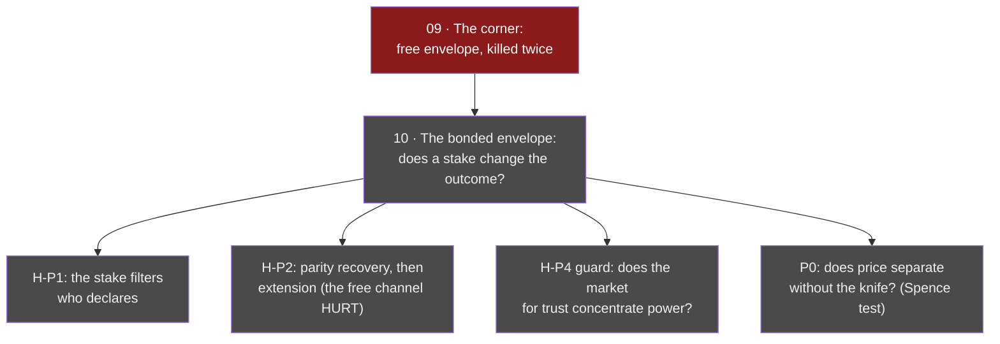

# 10 · The bonded envelope (opened Jul 8 — **OPEN**)

**Question.** Line 09 killed the free envelope twice: a costless promise about
outcomes is a subsidy to the defector, and an envelope loose enough to be kept
is loose enough to hide in. This line asks the next honest question: **does a
stake change the outcome?** A declaration backed by a contingent, mechanically
forfeited escrow — the hostage model (Schelling; Williamson 1983) — rather than
a costless one.

**Status.** Open. Preregistration drafted, kill-condition set, no runs.
Recorded grey before the first run, per the forge's rule.

## Design constraints, learned from literature and from a play

The stake is designed against Shylock's bond — the canonical *badly* designed
forfeit, whose every failure is a constraint here:

- **fungible** (resource currency, not flesh);
- **proportional** (a fraction, not an absolute — rich and poor zones stake the
  same share);
- **survivable** (forfeiture takes the escrow, not the zone's viability);
- **mechanical** (fail-closed, no referee discretion — a contract no court has
  to break to survive) — and the forfeit is **destroyed**, so the knife has no
  beneficiary and no one profits from wishing violation upon you.

## What would count as death

Kill, locked before any run: if the verified-bonded arms, at both stake levels,
neither recover parity with the no-channel baseline (the free channel *narrowed*
the domain — first bar is to stop hurting) nor improve the held-out world's
specificity, the stake does not heal the envelope — and this node turns red.
Background interpretation, filed in advance and never as a verdict: if even the
stake fails, legibility may not be attachable as a *channel* at all — only
built in as a *constitution* of the agent.

## The guard that is really a second question

H-P4, first-class: the bonded channel must not become a capture channel. If
trust can be bought, the wealthy buy it — and an anti-concentration mechanism
guarded by a concentration-rewarding gate would be a contradiction wearing a
solution's clothes. Wealth-conditional retention of declarations is a recorded
observable; its correlation with initial zone wealth is the signature to watch.

## Lineage

Child of [line 09](09-the-corner.md)'s honest remainder ("envelope *design* was
fixed — a differently shaped artifact is a new question, not a resurrection").
Disciplined, as always, by [line 07](07-gate-harness-to-fallacy-cutter.md).

> A free promise is information about nothing. A stake is information about
> the future — posted in a currency the future can confiscate.
