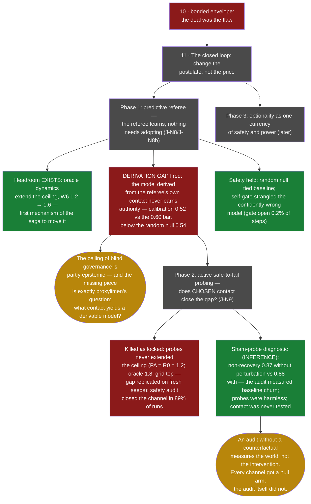

# 11 · The closed loop (opened Jul 8 · phases 1–2 ran Jul 8–9 — **OPEN; phase 1: derivation gap · phase 2: killed as locked, instrument implicated**)

**Question.** Three envelope deaths (lines [09](09-the-corner.md),
[10](10-the-bonded-envelope.md)) shared one untouched assumption — the forge's
own candidate fifth postulate:

> *Knowledge must exist as a portable, pre-verifiable artifact that a
> governance mechanism then consumes.*

Every wave changed the artifact's **price** — free, seeded, forced, taxed,
bonded — and none changed its **ontology**. This line changes the postulate
instead: learning and governance as two constraints on *one* interventional
process; safety as the preserved reversibility of the trajectory, not the
exclusion of states. The non-Euclidean test applies: the old mechanisms must
return as limits — horizon → 0 or calibration failure ⇒ the published reactive
justitia; permitted damage → 0 ⇒ the shield; governance off ⇒ a plain active
learner.

**Status.** Open; phases 1 and 2 have run
([J-N8](https://github.com/Kirill-Kruglov/justitia/tree/main/experiments/harnessed/J_N8_predictive_referee),
[J-N8b](https://github.com/Kirill-Kruglov/justitia/tree/main/experiments/harnessed/J_N8b_W7_predictive_referee),
[J-N9](https://github.com/Kirill-Kruglov/justitia/tree/main/experiments/harnessed/J_N9_active_probing),
all VALID, all FAIL). Phase 1: the middle branch of the preregistered kill —
the one written as a *reading*, not a death — fired: **the derivation gap**.
Headroom exists; the referee's own contact cannot derive it. Phase 2 asked
whether *chosen* contact closes the gap and died on both preregistered
branches at once — and a post-hoc sham-probe diagnostic showed the safety
audit had measured the world's own churn, not probe harm: the one component
of the design without its own null control strangled the experiment it was
guarding. The gap stands, sharpened; phase 3 remains open.

## Phase 1 — the surgical postulate change

The published justitia assumes *legitimate governance uses only realized
consequences*. Phase 1 replaces exactly that: the referee fits a transition
model of **observables** from its own intervention history (its allocations
and containments already are interventions; no new truth channel, blindness
intact — the model never sees strategy fields, in any arm, oracle included:
the oracle knows the *world's* dynamics, never the agents). Preemptive
containment fires on *predicted reachable harm* — but only while the channel's
own rolling calibration keeps earning it authority; below threshold it goes
silent and the referee is exactly the published one. Knowledge as a hypothesis
that perpetually pays for its authority with predictive performance — the
knife, rebuilt as an architecture.

Why this route around the graveyard: **there is no artifact→adoption segment
to die on.** Five arms: reactive baseline · oracle dynamics (headroom upper
bound) · derived-from-contact (the question) · random model of equal
complexity (the B2.3-style null: would a world with no information produce the
same answer?) · confidently-wrong model (the degradation test).

## Phase 1 — the outcome (Jul 8; J-N8 FAIL, J-N8b FAIL, both VALID)

The route around the graveyard worked as a *route*: nothing needed adopting,
nothing was declared, priced, or forgiven — and for the first time in the
saga, a mechanism moved the ceiling. The oracle arm, holding a true model of
the world's dynamics (never the agents'), extended the measurable adversarial
domain from 1.2 to 1.6 in W6, with the predictive gate open 64% of steps at
calibration 0.81. **Headroom exists.** The ceiling of blind governance is not
a brute fact of the substrate; part of it is the referee's ignorance.

Then the middle branch fired. The model *derived from the referee's own
intervention history* — same representation, same budget, same gate — never
earned authority: latest-window calibration 0.52 against the 0.60 bar,
*below* the random-parameter null at 0.54. Contact taught it nothing beyond
chance; the self-gate, doing exactly its job, kept it silent (0.8 preemptive
containments per run against the oracle's 32.8), and its worlds ran at
baseline. Not a catastrophe — a verdict: **predictability is present and
underivable from this contact.**

The safety architecture passed every test it was given. The random null tied
baseline exactly (the gain, where there is one, is information — the
tautology control held). The confidently-wrong model, built to lie with
confidence, was strangled by its own calibration ledger: gate open 0.2% of
steps, no damage (PW ceiling = baseline). And on the held-out world, the
first mechanism with a *reason* to fix J-N3's specificity pain — catastrophic
and exploitative harm have different dynamical signatures — did not fix it:
false containment 0.4975 vs 0.4989, and the oracle arm was *worse* (0.52).
Even true dynamics do not tell a catastrophe's face from an exploiter's.

What died: phase 1's mechanism as implemented — passive derivation from the
referee's own interventions, linear-ensemble representation, this contact
regime. What did not die: the line. The gap between "the world is predictable"
and "this contact derives it" is proxylimen's wall standing inside justitia's
substrate — and phase 2 (active safe-to-fail probing) was designed, before
this result existed, as exactly the question of *choosing* contact for
information. The gap is not an obstacle on the way; it is the way.

## Phase 2 — the outcome (Jul 8–9; J-N9 FAIL, VALID; the instrument implicated)

Phase 2 changed one more postulate: the referee may spend a bounded budget of
small reversible probes — interventions for information, not for governance.
Five arms (baseline · oracle · passive-derived replica · information-directed
probes · matched random probes), a structural health guard before each probe,
and a mechanical recovery audit after it, closing the channel fail-closed if
non-recovery exceeded 10%.

Both preregistered kill branches fired at once. The probes never extended the
ceiling (PA = R0 = 1.2 while the oracle reached 1.8 — the top of the grid;
the derivation gap replicated exactly on fresh seeds). And the safety audit
closed the probe channel in ~89% of runs: measured non-recovery was 0.80
against the 0.10 budget.

Then the diagnostic, run after the verdict and labeled as INFERENCE: **sham
probes** — identical guard, schedule, selection, and audit, but no actual
perturbation — show non-recovery 0.87 against the real probes' 0.88. The
criterion was measuring the world's own churn: a healthy W6 zone fails the
admission margin within five steps ~87% of the time with no intervention at
all. The probes were harmless (excess +0.01, consistent with PA's ceiling
equalling baseline rather than narrowing). The audit — the only component of
the design without its own null control — throttled the channel after ~5
probes per run, so the contact question phase 2 existed to ask was measured
under almost no additional contact.

What died: phase 2 as locked — including its safety instrument, which is the
deeper finding. The forge gave every *channel* a null arm (PR in phase 1, PN
in phase 2) and forgot to give one to the *audit*: an audit without a
counterfactual measures the world, not the intervention. The kill is
published exactly as preregistered; the diagnostic is not a rescue but a
lesson — any phase-2b must preregister a counterfactual-controlled recovery
criterion (sham-adjusted, or paired unprobed control zones) as a new gate.
What the wave still bought: the derivation gap replicated on fresh seeds, the
headroom bound moved from 1.6 to the grid top, and the substrate's baseline
volatility is now a measured quantity instead of an implicit assumption.

## The shoulders (first line born with them)

Reversibility as a learnable signal
([Grinsztajn 2021](https://arxiv.org/abs/2106.04480);
[rollback-RL 2025](https://arxiv.org/abs/2510.14503)); options/reachability as
the safety object ([Krakovna, relative reachability](https://arxiv.org/abs/1806.01186);
[Turner, power-seeking via optionality](https://arxiv.org/abs/2206.11831) —
the pearl: optionality is one currency for *safety* and for *power*, which is
justitia's capture in another notation); shielding's exploration trade-off,
formalized ([probabilistic shielding](https://arxiv.org/abs/2503.07671)) —
line 03's lesson has a name in the literature; safe sets = viability kernels
([CBF learning](https://arxiv.org/abs/1912.10099)), bridging to Aubin, whom
the essay already cites; budgeted interventional design
([Zhang et al., Nature MI 2023](https://www.nature.com/articles/s42256-023-00719-0));
safe-to-fail as a fifty-year-old management philosophy (Holling 1978, adaptive
management). The sparse spot this line occupies: a *blind anti-concentration*
referee coupled to an interventional learner in an evolutionary world with
capture pressure, under fail-closed preregistration — plus a dowry no neighbor
has: three preregistered envelope deaths as the negative base.

## Lineage

Provenance: the author's fifth-postulate question (is a wall a fact of the
world or of the framing?), sharpened in dialogue with GPT against this very
map, disciplined by [line 07](07-gate-harness-to-fallacy-cutter.md). The
dialogue's four-question test for a cardboard wall is adopted as this line's
own gate: what stayed constant across failures; can the problem be made
nonexistent rather than solved; does the old return as a limit; does the new
make a discriminating prediction. Phase 1's discriminating prediction, stated
before any run: *a calibrated predictive referee shifts the adversarial
ceiling; a bonded declaration only changes who declares.*

The reckoning, after the run: the prediction was half right, and the half
matters. A calibrated predictive referee *does* shift the ceiling — when the
model is true (PO: 1.2 → 1.6). It does not shift it when the model must be
derived from the referee's own contact (PD: calibration below the random
null). The fifth-postulate move survives its non-Euclidean test — the old
mechanism returned exactly as the limit (calibration below threshold ⇒ the
published reactive justitia, byte-identical when off) — but the new geometry
is only reachable with knowledge this referee cannot yet earn. Which returns
the forge, with instruments in hand, to the question proxylimen asked in
prose: not *whether* derived knowledge beats inherited, but *what contact is
sufficient to derive it*.

> Perhaps knowledge is never finally handed over. It stays a hypothesis,
> perpetually paying for its authority with predictions the world can
> confiscate.
