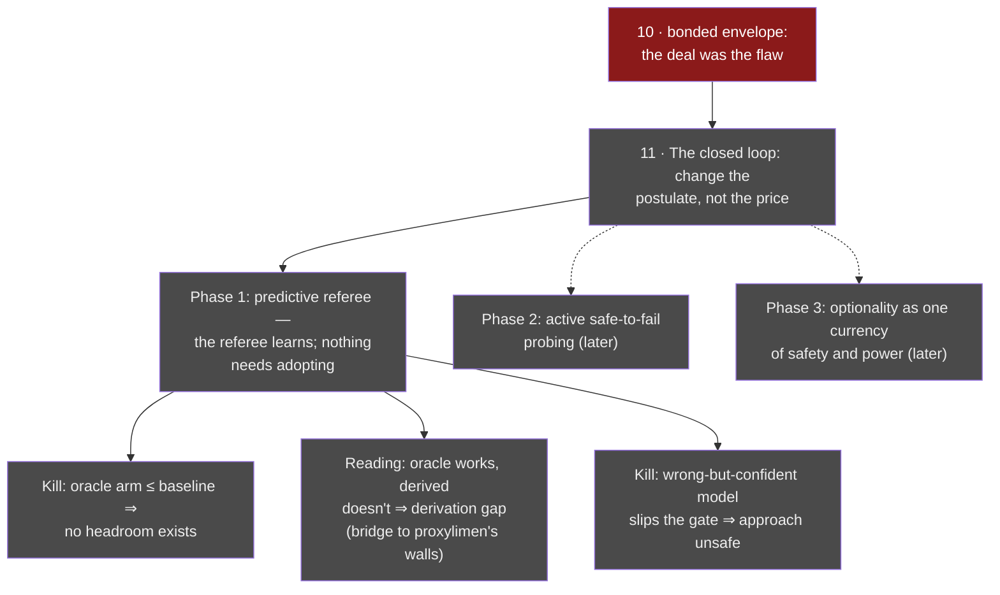

# 11 · The closed loop (opened Jul 8 — **OPEN**)

**Question.** Three envelope deaths (lines [09](09-the-corner.md),
[10](10-the-bonded-envelope.md)) shared one untouched assumption — the forge's
own candidate fifth postulate:

> *Knowledge must exist as a portable, pre-verifiable artifact that a
> governance mechanism then consumes.*

Every wave changed the artifact's **price** — free, seeded, forced, taxed,
bonded — and none changed its **ontology**. This line changes the postulate
instead: learning and governance as two constraints on *one* interventional
process; safety as the preserved reversibility of the trajectory, not the
exclusion of states. The non-Euclidean test applies: the old mechanisms must
return as limits — horizon → 0 or calibration failure ⇒ the published reactive
justitia; permitted damage → 0 ⇒ the shield; governance off ⇒ a plain active
learner.

**Status.** Open. Phase 1 preregistration drafted, kills set, no runs. First
line of the forge born with its shoulders listed (see below).

## Phase 1 — the surgical postulate change

The published justitia assumes *legitimate governance uses only realized
consequences*. Phase 1 replaces exactly that: the referee fits a transition
model of **observables** from its own intervention history (its allocations
and containments already are interventions; no new truth channel, blindness
intact — the model never sees strategy fields, in any arm, oracle included:
the oracle knows the *world's* dynamics, never the agents). Preemptive
containment fires on *predicted reachable harm* — but only while the channel's
own rolling calibration keeps earning it authority; below threshold it goes
silent and the referee is exactly the published one. Knowledge as a hypothesis
that perpetually pays for its authority with predictive performance — the
knife, rebuilt as an architecture.

Why this route around the graveyard: **there is no artifact→adoption segment
to die on.** Five arms: reactive baseline · oracle dynamics (headroom upper
bound) · derived-from-contact (the question) · random model of equal
complexity (the B2.3-style null: would a world with no information produce the
same answer?) · confidently-wrong model (the degradation test).

## The shoulders (first line born with them)

Reversibility as a learnable signal
([Grinsztajn 2021](https://arxiv.org/abs/2106.04480);
[rollback-RL 2025](https://arxiv.org/abs/2510.14503)); options/reachability as
the safety object ([Krakovna, relative reachability](https://arxiv.org/abs/1806.01186);
[Turner, power-seeking via optionality](https://arxiv.org/abs/2206.11831) —
the pearl: optionality is one currency for *safety* and for *power*, which is
justitia's capture in another notation); shielding's exploration trade-off,
formalized ([probabilistic shielding](https://arxiv.org/abs/2503.07671)) —
line 03's lesson has a name in the literature; safe sets = viability kernels
([CBF learning](https://arxiv.org/abs/1912.10099)), bridging to Aubin, whom
the essay already cites; budgeted interventional design
([Zhang et al., Nature MI 2023](https://www.nature.com/articles/s42256-023-00719-0));
safe-to-fail as a fifty-year-old management philosophy (Holling 1978, adaptive
management). The sparse spot this line occupies: a *blind anti-concentration*
referee coupled to an interventional learner in an evolutionary world with
capture pressure, under fail-closed preregistration — plus a dowry no neighbor
has: three preregistered envelope deaths as the negative base.

## Lineage

Provenance: the author's fifth-postulate question (is a wall a fact of the
world or of the framing?), sharpened in dialogue with GPT against this very
map, disciplined by [line 07](07-gate-harness-to-fallacy-cutter.md). The
dialogue's four-question test for a cardboard wall is adopted as this line's
own gate: what stayed constant across failures; can the problem be made
nonexistent rather than solved; does the old return as a limit; does the new
make a discriminating prediction. Phase 1's discriminating prediction, stated
before any run: *a calibrated predictive referee shifts the adversarial
ceiling; a bonded declaration only changes who declares.*

> Perhaps knowledge is never finally handed over. It stays a hypothesis,
> perpetually paying for its authority with predictions the world can
> confiscate.
