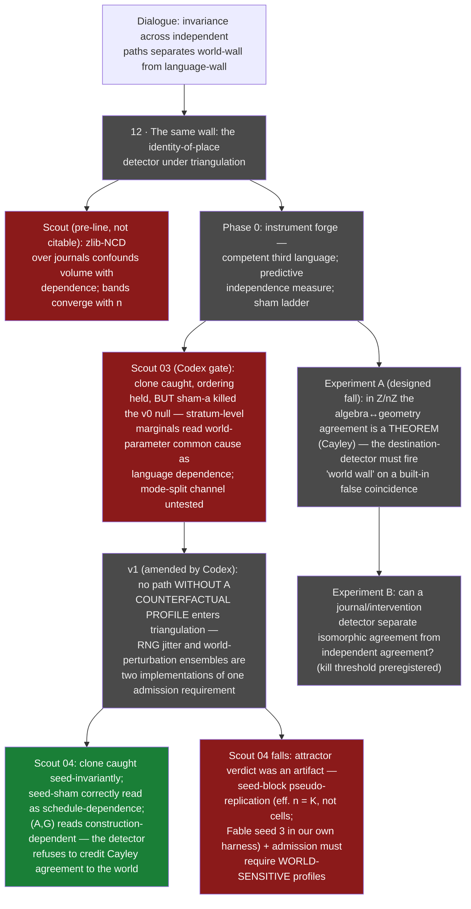

# 12 · The same wall (opened Jul 9 · **OPEN; phase 0 running — first scout fall already recorded**)

**Question.** The epistemology dialogue (`epistemiology_opus_talk`, Jul 9)
closed on one load-bearing wall:

> *How do you tell that two independent paths arrived at THE SAME dead end,
> and not at two neighboring ones?*

Everything above it stands on this detector. The dialogue's summit —
**invariance across independent paths separates a wall of the world from a
wall of the language** — is a triangulation procedure, and triangulation
stands on identity-of-place. If the identity detector lies, two correlated
trajectories sharing one blindness produce a **false world-invariant**: a
confident, low-variance, wrong intersection (Fable review, seed 3). The
original engineering question of the line — *how does a model earn
experience in pure algebra and geometry?* — reduces, per the dialogue's core,
to: one task, many independent languages, a ledger of what survives the
change of derivation route. That ledger has exactly one unproven load-bearing
component. This one.

**Status.** Open. Analytical base audited ready on Jul 9 (dialogue core +
Codex review + Fable reviews); the remaining open questions are
instrument-level and resolvable only computationally. Phase 0 (scouts, not
citable) is running. One designed fall has already been taken and paid out:
surface compression (zlib-NCD over journals) **fails as an independence
measure** — it tracks journal volume, not algorithmic dependence, and its
dependent/independent bands converge as the world grows (the B2.3 lesson —
"more data made things worse" — reproduced on our own instrument at first
contact). No prereg is locked around a broken instrument: phase 0 must
deliver a measure that survives its own sham ladder first.

## The world, the task, the languages

Chosen for minimality and external truth (Codex review, adopted):

- **World.** `Z/nZ` with anonymous states, one generator `R`, `L = R⁻¹`.
  Truth is fully known outside (`u(x₀)=v(x₀) ⇔ net(u) ≡ net(v) mod n`) and
  fully hidden inside.
- **Task (extensional, no ontology smuggled).** Given a bounded budget of
  oracle queries "do these two words land on the same state?", predict
  equality for unseen word pairs.
- **Interface `I`.** The equality oracle, shared by all languages. Held fixed
  in phase 0/A and *named honestly*: invariance across languages at fixed `I`
  is invariance-of-language-at-this-channel, never yet a fact of the world
  (the `W → I → L` split; the interface is itself a later sham target).
- **Languages** as quadruples `(P, C, S, K)` — primitives, composition,
  search moves, description cost. Language A (algebra: minimal relation
  `Rᵐ = e`), language G (geometry: fundamental cycle of the state graph),
  language P (probabilistic/coding; must be made *competent* — see scout
  lessons). A path is a **journal** `π = (h₀, q₁, o₁, h₁, …)`; a reper is a
  prediction error; a dead end is `sev_L → 0` (nothing in L compresses
  further).

## The built-in gift: Cayley as a free sham

In this world algebra and geometry are glued by the Cayley graph: `Rⁿ = e`
and "the cycle has length n" are one number under an isomorphism. Their
agreement is a **theorem, not evidence**. So the cheapest kill comes first
and is designed before any positive claim:

> **Experiment A (preregistered fall).** A naive detector that reads
> *destinations* ("both languages report m ⇒ world wall at m") MUST be
> fooled by the isomorphic pair. If we cannot build a detector that
> abstains here, everything downstream is uncitable — agreeing languages
> would crown the algebra↔geometry dictionary as an empirical discovery
> (the `information_ratio = 0.047` class of error, at line scale).

The deeper stake, from the recovered dialogue tail: *found vs made* becomes
two instruments. The **destination detector is the platonist** (structure
sits in the object; read the result). The **journal detector is the
constructivist** (structure is the performed assembly; read the trajectory).
Phase A/B runs them against each other.

## The sham ladder (rule 3: every filter gets its null arm)

Three kinds of false coincidence, all constructible here because truth is
external (Codex review, adopted as the line's spine):

1. **Shared interface** — both languages see through the same slit; their
   agreement is the channel's, not the world's.
2. **Shared postulate** — implanted common blindness: two surface-different
   languages carrying one hidden shared assumption (in `Z/nZ` the A↔G
   isomorphism stands as this sham for free; a decorated-clone language —
   same effective channel under cosmetic renaming/noise — is the adversarial
   version the instrument must also catch).
3. **Neighboring dead ends** — `Z/nZ` vs `Z/mZ`, m near n: distinct walls
   the detector must NOT merge.

Kill discipline: the identity detector is only trusted after it (a) abstains
on implanted coincidences, (b) separates neighbors, (c) still fires on the
genuine article. Thresholds go into `PREREG.json` before the citable run;
scouts may fall freely before the lock, and their falls are recorded.

## Phase 0 — instrument forge (running)

1. **Competent third language.** Scout lesson: the first probabilistic
   language (gcd over random returns) failed to reach the wall for `n ≥ 12` —
   an incompetent independent language confounds *incompetence* with
   *independence*. The independent route must actually arrive.
2. **Predictive independence measure.** Replace surface compression with
   reper-prediction: path B is dependent on path A iff knowing B's journal
   predicts *where A gets surprised* cheaper than A's own entropy. Decomposed
   over questions (probe policy) and answers (oracle bits), because in a
   world pinned by any competent journal, answer-prediction saturates
   trivially — the signal, if any, lives in the surprise structure.
3. **Sham ladder v0** — the three false coincidences above, built and thrown
   at the measure before any prereg lock.

**Scout 03 (Codex adversarial gate, Jul 10 — instrument v0 fell, twice
informative).** Codex (GPT 5.5, relayed) specified: failure tokens
(SUCCESS/ABSTAIN/WRONG_CONFIDENT/WRONG_DEGRADED/TIMEOUT), a marginal-null
arm with Monte Carlo resampling, metrics M1–M4 with a fixed verdict rule,
and two sham pairs — (a) independent languages sharing a small hypothesis
grid (error attractor), (b) one shared blind postulate with split surface
modes (lie-with-value vs abstain). Preregistered outcomes: clone caught
(M1 excess 0.267, p=.001), ordering clone > isomorph > independent held
(0.267 > 0.192 > 0.000), independents clean. **Both prediction errors are
the payout:** sham-(a) was NOT explained away — stratum-pooled nulls read
world-parameter common cause as language dependence (the Codex
"world-difficulty" confound returning through the remedy for point-mass
marginals); sham-(b) was caught, but by the M1 value channel, so the
mode-split channel (M3/M4) remains untested-positive, not confirmed. The
measured dilemma: per-instance nulls blind the detector to deterministic
clones; per-stratum nulls hallucinate dependence through the world. **v1
hypothesis (line-level candidate theorem): no deterministic path enters
triangulation** — every language must carry internal randomness so that
per-instance nulls become identifiable; then instance-level coupling
beyond the null = shared construction, stratum-level coupling = shared
world. Artifacts: `experiments/12_same_wall/scouts/scout_03_codex_gate.py`.

**Scout 04 (v1: counterfactual profiles, Jul 10 — core survived, two new
falls, both paid).** Codex's second review amended the v1 hypothesis before
the build: stochastization is a property of the *instrument*, not of
triangulation — a deterministic path gets its "how else would you have
climbed" bundle from a fixed, truth-preserving ensemble of world
perturbations (basepoint shift, generator reversal, budget ±, noise
reseed). Admission requirement restated: **no path without a counterfactual
profile enters triangulation.** Scout 04 built the two-floor design:
per-instance pooled nulls + a seed-decorrelation control (construction
dependence must survive crossing the languages' internal seeds).
Outcomes: clone caught seed-invariantly (E1, and with it E6 — deterministic
paths admitted via perturbation profiles); the deliberate shared-scheduler
pair correctly downgraded to CONTACT_SCHEDULE_DEPENDENT (E3); independents
clean (E5); and (A,G) reads CONSTRUCTION_DEPENDENT — the detector refuses
to credit the Cayley pair's agreement to the world, which is precisely the
abstention Experiment A requires (thin margin over the clone, 0.087 vs
0.095 — not to be over-read before the null is fixed). The falls: (1) the
attractor pair's verdict was an artifact of **seed-block
pseudo-replication** — with world-insensitive languages every cell repeats
the same K=3 seed pairs, effective sample size is K, and the cell-level
null hallucinates significance (Fable seed 3 — effective sample size under
dependent evidence — arriving inside our own harness); remedy: the null
must resample at the seed-block level, K ≥ 8. (2) The admission criterion
completes: the counterfactual profile must be **world-sensitive** — a
language whose profile answers only its own dice never touched the world
and cannot testify about walls; the attractor pair is not "falsely
dependent" but inadmissible. Deferred and still owed: Codex shams S2
(stochastically masked shared blindness) and GatedLollipop mode-split.
Artifacts: `experiments/12_same_wall/scouts/scout_04_v1_counterfactual.py`.

## Discipline inherited

`gate_harness` ported verbatim from
[fallacy-cutter](https://github.com/Kirill-Kruglov/fallacy-cutter) (the
polished extraction of proxylimen's harness; field-tested on a foreign
project — justitia — with three provenance-signed decisions). Test suite ran
green in this repository at port time (18/18). Prereg lock, leakage scans,
tautology checks, seed policy, and `verify_decision` apply to every citable
run of this line; scouts are labeled scouts and never cited.

## Lineage

Provenance: the epistemology dialogue (Kirill × Opus 4.8, Jul 9), read as a
route: 0D → value → pair → set-with-relation → correlation-folding →
Kolmogorov's two faces → the three states (climb / fall / ascend) → repers as
prediction errors → the balcony as +1D → **invariance across independent
paths** — with the identity-of-place question left deliberately open as the
entry to this wall. Sharpened by: Fable review seeds 1–3 (severity as
two-place predicate; the Carnapian trigger as a measurable state; correlated
blindness of sources), the Codex review (the `W → I → L` trichotomy; behavior
under intervention over signature similarity; the extensional task; the
three-sham taxonomy), and one pre-line scout fall (zlib-NCD volume confound).
Direct methodological ancestor: proxylimen B2.3 — the discrimination boundary
against a null family, and A.6's mechanism diagnostic, which is this line's
detector question asked one floor lower.
