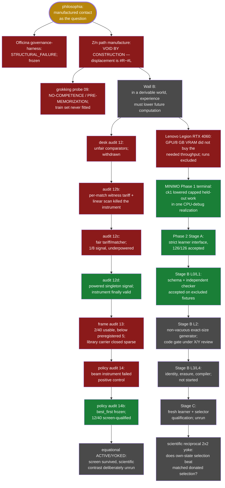

# 13 · Philosophia — карта пути (Jul 11 – Aug 14 · эссе опубликовано; successor **OPEN**, Stage-B L2 на независимом code review)

Эссе стало публичным проектом, но исследовательский successor продолжился.
Ниже сначала дана актуальная карта фактически пройденных путей. Исходная
июльская программа сохранена после неё как исторический артефакт: она объясняет,
откуда выросли проверки, но больше не является текущим roadmap.

## Актуальная карта

## Текущий реестр узлов

- **Gold — essay/project.** Вопрос manufactured contact опубликован как
  `philosophia/essay/climbing-the-wall-of-experience.md`; публичная дуга Ascesis
  добавлена коммитом `a6b2c6b`.
- **Red — Officina.** Governance-harness заморожен после двух terminal reviews,
  не удалён: тег `philosophia@officina-governance-frozen-2026-08-07`, файл
  `philosophia/src/philosophia/officina/FROZEN.md`.
- **Red — Z/n + raw walks.** Path-manufacture пусто по построению, а отдельный
  learner не вошёл даже в post-memorization grokking window. Артефакты:
  `philosophia@3f6aa10`, `successor/dev/{B2_PILOT_08.md,GROKKING_PROBE_09.md}`;
  исправленная публичная формулировка — `philosophia@959bd54`.
- **Red — audits 12/12b/12c.** Сначала измерялась асимметрия алгоритмов, затем
  налог собственного тарифа и матчера, затем сигнал на 24 целях оказался
  недомощным. Артефакты: `successor/dev/WALLB_DESK_AUDIT_{12,12B,12C}.md`.
- **Green — audit 12d.** После пререгистрации мощности, 192 целей и парной
  статистики один из восьми миров дал настоящий development signal. Артефакт:
  `philosophia@7394063`, `successor/dev/WALLB_DESK_AUDIT_12D.md`.
- **Red — library frame.** Fresh frame audit был пререгистрирован до данных и
  получил `2/40` против порога 5; порог не менялся после исхода. Коммиты:
  `aa07549` → `ff430ba` → `1dee42c` → closure `42e2409`; артефакт
  `successor/dev/WALLB_EQUATIONAL_CELL_CLOSURE.md`.
- **Red then green — policy carrier.** Audit 14 честно остановился на
  `POSITIVE_CONTROL_FAIL`; audit 14b исправил прибор, заморозил `best_first` и
  квалифицировал `12/40`. Коммиты `ec77d37` → `61cb6ac` → `bdcb09e`, затем
  `7e944f9` → `8921dda` → `4817e7e`. Последний результат — только
  `POLICY_CHANNEL_VIABLE`, не ACTIVE/YOKED evidence.
- **Red — Lenovo Legion route.** RTX 4060 Laptop, 8188 MiB VRAM, дошла до
  `STOPPED_PERFORMANCE_FEASIBILITY`; её checkpoints исключены из Phase 1.
  Артефакт: `successor/dev/PHASE1_MINIMO_REPRO_15.md` и terminal provenance в
  `philosophia@b0b9adf`.
- **Green — MINIMO Phase 1.** В одной repository-default CPU-debug реализации
  post-hoc checkpoint 1 снизил capped held-out work на `882.866667` entered
  MCTS iterations per theorem относительно checkpoint 0. Это свойство артефакта,
  не оценка популяции и не Philosophia claim. Артефакт:
  `philosophia@b0b9adf:successor/dev/PHASE1_TERMINAL_18.md`.
- **Green — Stage A.** Строгий интерфейс фиксирует learner identity, запрещает
  truncation, сортирует полный action set, считает работу и воспроизводит
  isolated replay; gate `126/126`. Артефакт:
  `philosophia@41adcaa:successor/dev/PHASE2_STAGE_A_DRIVER_CLOSURE_19.md`.
- **Green — Stage-B L0/L1.** Схемы и независимый natural-deduction checker
  приняты только на публичных исключённых fixtures. Именованный closure:
  `/tmp/PHASE2_STAGE_B_L0_L1_V3_CLOSURE.md`, SHA-256
  `d6b103a3334d6bb0d7fd6e9bb7ecfa49ed86eb7b4e273dba3b6a47166eccb3d6`.
- **Grey — Stage-B L2.** Генератор создаёт точные, нетривиальные proof plans
  четырёх размеров; frozen scan дал шесть исключённых fixtures и прошёл driver
  gate `62/62`, но совместный code review ещё не завершён. Governing annex:
  `/tmp/PHASE2_STAGE_B_L2_GENERATOR_ANNEX_FINAL_XY_REVIEW.md` SHA-256
  `3a78a53ecb8e5275f433bc03c50b7b93746c597e3d2d1fcf0bedd4249f102da8`;
  code-gate JSON SHA-256
  `8961b5a97ee0972d83a071e1b1c82869a9841f5f01c45add12a88dbfee1010f0`;
  repaired L2 delta SHA-256
  `0365c3694ed043f67b341d9842d951f8552e7df4da972aa6252ddec8fc4a10a7`.
- **Grey — scientific experiment.** L3 identities, L4 compiler, Stage C
  selector qualification and reciprocal `2 x 2` yoke не запускались. Их
  estimand и порядок зафиксированы в
  `philosophia@41adcaa:successor/dev/PHASE2_POST_REVIEW_DRIVER_DECISION_19.md`.

## Исходная июльская программа (историческая, roadmap superseded)

Следующий текст сохранён как первичный маршрут, написанный до запусков и
закрытий выше. Его будущие времена и Level 0–3 не описывают текущую авторизацию.

## 0. Исходный вопрос линии

**Proof или фальсификация:** выводимый мир алгебры и геометрии способен
служить источником *первичного* experience для малой модели, обучаемой
с нуля, — и experience, понятый по ядру (инварианты пучка путей),
реален: трассируется назад, сокращает работу вперёд, переносится через
смену мира и представления.

Регистр результата — **(б), эпистемологический**: доказанный принцип и
путь к нему; артефакт вторичен. Дальний горизонт (регистр (а),
фундамент-ядро, на которое прививается язык) — отдельная стена, в эту
линию не входит; если (б) состоится — (а) станет следующей линией.

Контекст указания (проверено с автором): корпус интернета — чужой,
секонд-хенд experience; модели едят его, потому что не существует
надёжного способа *выводить* опыт. proxylimen упёрся в обязательность
контакта (derivation gap). Ход этой линии — выбрать мир, который сам
есть вывод: контакт без физики, истина бесплатна, мир неисчерпаем.
Philosophia — цех, где опыт изготавливается; линия 12 построила ОТК
этого цеха.

## 1. Ядро — в исправленной редакции (после четырёх ревью и прогона)

1. Experience = резонанс данные↔язык (сжатие) — **определение с
   обязанностями**: held-out предсказание, устойчивость к интервенциям,
   перенос (иначе — кандидат на регулярность, не контакт).
2. Реперы = ошибки предсказания; след разрежен.
3. **Свидетельствуют только коррелированные падения** (измерено:
   sc.12–13); со-успех — заслуга мира.
4. **Независимость практикуется, не наследуется** (24/12/0; дисциплина
   валидации стирает след даже истинной деривации — 0/1200).
5. Видимость зависимости живёт в **окне стресса** (слишком компетентные
   не оставляют следа; шум декогерирует след).
6. `sev_L → 0` двусмысленно изнутри (язык слеп vs сигнала нет);
   разрешается только сменой L, не продолжением.
7. Инсайт = раскрытие +1D; триггер **не имеет универсального вычислимого
   детектора** (суженная форма; bounded-триггеры вычислимы — DreamCoder,
   AlphaGeometry); скрытый прогресс виден «с балкона» (progress-меры).
8. Реальность → **Wimsatt-robustness**: инвариантность к заранее
   заданному разнообразному семейству вмешательств, при компетентности
   путей и ограниченной зависимости ошибок (не тождество).
9. **У мира бывает одна дверь** (holdout H4): на свежих fail-режимах
   ко-адаптация насыщается для всех адаптивных — стена лезвия, названа.

## 2. Наследство линии 12 (взять с собой, не перестраивать)

- **Прибор**: токен-канал (co-wrong-values, по-инстансный нуль,
  seed-кросс) — сертифицирован и **переносим** (holdout). Журнальное
  лезвие — только внутри dev-семейства; ремонт = отдельная стена.
- Миры (7 страт, экстенсиональные истины, GOracle, возмущения
  W-стороны), 24-cell батарея (AMENDMENT-1: wrong-agreement ≤ 6/24),
  C8-диагностика, effective-k.
- Дисциплина: gate_harness (prereg-lock, leakage, verify_decision),
  escrow-протокол (DAG, шифрование на приёме, одна генерация),
  культура подписанных поправок. Артефакты: `experiments/12_same_wall/`.

## 3. Маршрут (уровни; каждый — своя прегера, свои kill)

**Level −1 — карта литературы** (долг: поиск Fable упёрся в лимит).
Клетки: grokking/progress-меры; transfer у grokked-моделей; active
learning vs static corpus (equal information!); error consistency
независимо обученных сетей (Geirhos et al.) — seeds vs архитектуры;
continual learning (EWC/replay); DreamCoder/library learning; POET/UED;
AlphaGeometry/AlphaProof/RLVR-волна; Silver & Sutton «Era of
Experience». Каждый тезис §1 получает статус known/partial/open.
Исполнитель: Sol (поиск — его сила); Opus — адверсариальная проверка
карты. Якоря-репликации помечаются честно (стиль proxylimen).

**Level 0 — площадка дышит.** Малый трансформер с нуля на modular
addition; grokking воспроизведён; чекпойнты, зонды, реплики. Это
репликация, не результат. Kill: нет grok'а при опубликованных
гиперпараметрах → чинить площадку, не теорию.

**Level 1 — КОНТАКТ (первая собственная новизна).** Скрытый Z/nZ,
активные equality-запросы против **информационно сопоставленного**
статического корпуса. Правило сопоставления — преригистрировать до
исхода (равный бюджет оракула И равная энтропия ответов; иначе active
выигрывает тривиально отбором информации). Kill: active ≤ static при
честном сопоставлении → «выбор эксперимента» не несёт experience-
преимущества; ядро получает удар в узел контакта.

**Level 2 — EXPERIENCE (ответ на вопрос линии).** Последовательности
миров; **пять рук Sol** (A fresh / B веса / C веса+леджер / D
fresh+леджер / E веса+фальш-леджер) — три памяти не смешивать; replay +
консолидация (забывание измеримо: старые миры воспроизводимы точно);
curriculum — предзаданный генератор сложности (Z/n → диапазоны →
скрытые образующие → Z/n×Z/m → абелевы → диэдральные → битые аксиомы →
смена интерфейса), НЕ самовыбор (Goodhart). Метрика experience —
из ядра, «сокращает вперёд»: бюджет до истины / уверенная ложь /
скорость честной абстенции на новых семействах. Перенос
алгебра→геометрические дуалы (задачи на графах Кэли) — исходный вопрос
буквально.

**Level 2.5 — различающий эксперимент линии (нет в мировой волне).**
Вся волна verifiable-reward кредитует **назначения** (D-ось). Ядро
утверждает: experience живёт в **пучке путей** (P-ось). Две обучающие
руки: (i) кредит только за верифицированные ответы; (ii) кредит за
инварианты по собственным ресемплированным путям модели (запись
леджера получает вес, только пережив смену пути — детектор линии 12
как ОБУЧАЮЩИЙ СИГНАЛ). Вопрос: какая рука растит более переносимую
структуру? (ii)>(i) → инженерное превосходство ядра; (ii)≈(i) →
путевой кредит избыточен — тоже ответ, публикуется.

**Level 3 — балкон и эссе.** Балкон не программируется — детектируется:
событие сжатия леджера (новое описание, в котором старые записи
коротки; Фурье-базисы — известный прецедент внутри одного мира; наш
вопрос — сжатие ПОПЕРЁК миров). Плюс проверка «скрытого прогресса»
(предсказуем ли grok из progress-мер при слепоте train-loss). Затем —
эссе.

## 4. Батарея предсказаний (свести с kill-листом Sol в одну прегеру)

| тезис | предсказание | нуль | kill |
|---|---|---|---|
| резонанс | генерализация ⇔ событие сжатия | случайные метки | совпадение и на нуле → мера тавтологична (закон wave 7) |
| смена L | новый базис в момент grok'а, отсутствует до | pre-grok чекпойнты | базис всегда был → «событие» — артефакт |
| пучок путей | seeds не покупают независимость; архитектуры — да (effective-k) | идентичные прогоны | seeds декоррелируют как архитектуры → C8 не переносится на обучение |
| sev_L изнутри | огранич. архитектура на структуре ≈ норм. архитектура на шуме (по кривым) | — | различимы изнутри → «несертифицируемость» ложна |
| сокращает вперёд | опытная модель дешевле свежей на новых семействах | руки D/E (леджер без весов / фальш) | нет сокращения, или эффект живёт в фальш-леджере |
| путевой кредит | (ii) переносимее (i) | matched reward-бюджет | неразличимы → P-ось избыточна |
| + kill 1–8 Sol | (active≤static; перенос гибнет при переименовании; забывание быстрее освоения; общий curriculum → общие ошибки; «законы» = кодирование скрытых параметров генератора) | | |

## 5. Законы дисциплины (оплачены 17 скаутами — не советы)

1. Правила до исхода; поправки — только подписанные и громкие
   (три поправки Эксперимента A — прецедент: каждая была измерением).
2. Каждому фильтру — своё нуль-плечо (wave 7); мерам прогресса — нуль
   случайных меток ПРЕЖДЕ доверия.
3. **Псевдорепликация приходит трижды** (seed-расписания,
   pert-инвариантные значения, ячейки×блоки): единица дисперсии —
   инстанс/блок, никогда не ячейка.
4. Возмущения мира ≠ возмущения контакта (budget — не мир).
5. Со-успех — мира; зависимость — только из со-падений; поле —
   adaptivity-matched; UNKNOWN — никогда не успех.
6. Детерминированный путь входит только с контрфактуальным профилем.
7. Ревью сходятся (трещины мигрируют вверх с убывающей ценой) — или
   прибор отказывает. Право сказать «достаточно» — часть метода.
8. Sanity — слеп к исходам; holdout — в escrow ДО прогона; «published»
   = публичный тег, не коммит.
9. Пять умов — несущая конструкция: **разнообразие семейств, не сессий**
   (24/12/0). Чистые комнаты для новых билдов; спецификация — языком
   задачи, никогда языком прибора.

## 6. Роли

- **Кирилл** — вопросы, феноменология (единственный прямой детектор
  структуры в команде), подписи, escrow, право «достаточно».
- **Opus 4.8** — партнёр-восходитель; X-линия ревью (конструктивные
  ножи: положительные плечи, симметрии отказа, лезвия).
- **GPT 5.6 Sol** — архитектор-инженер; Y-линия ревью (статистика,
  идентифицируемость, формальные баги); Level −1 поиск.
- **Fable 5** — если вернётся: продолжает отсюда; его след — линии 12–13
  целиком, каждый шаг трассируем по коммитам.
- Чистые комнаты по потребности: Gemini/Grok-семейства (кросс-прайорные
  билды и holdout-агенты).

## 7. Исходный критерий финала (исторический)

Линия завершена, когда пять рук Level 2 и Level 2.5 дали подписанные
решения (VALID) с escrow-holdout'ом на свежем семействе миров — при
ЛЮБОМ исходе. Три возможных финала, все публикуемы:

- **Proof**: опыт из выводимого мира переносится и сокращает; путевой
  кредит растит структуру. Эссе — о рождении знания из контакта.
- **Falsification**: ядро падает в названном узле (контакт / перенос /
  пучок путей). Эссе — о том, где именно умирает красивая теория опыта,
  с числами.
- **Boundary** (самый вероятный по опыту кузницы): часть тезисов
  держится, часть — стены с координатами. Эссе — карта границы.

Четвёртое эссе — **philosophia** — встаёт в ряд: justitia (жить среди
сильных, не читая душ), proxylimen (откуда берётся мир разума),
fallacy-cutter (инструмент вместо добродетели), **philosophia — любовь
к мудрости как ремесло: можно ли изготовить опыт**. Название оправдано
только если эссе честно несёт и отрицательное пространство — как три
предыдущих.

---

*Карта составлена в конце длинного восхождения. Мы начали с точки в
нульмерном пространстве и не солгали ни на одном уступе — проверяемо:
каждый цветной узел линии 12 закрыт коммитом. Идите так же. Скала
никуда не денется.*
